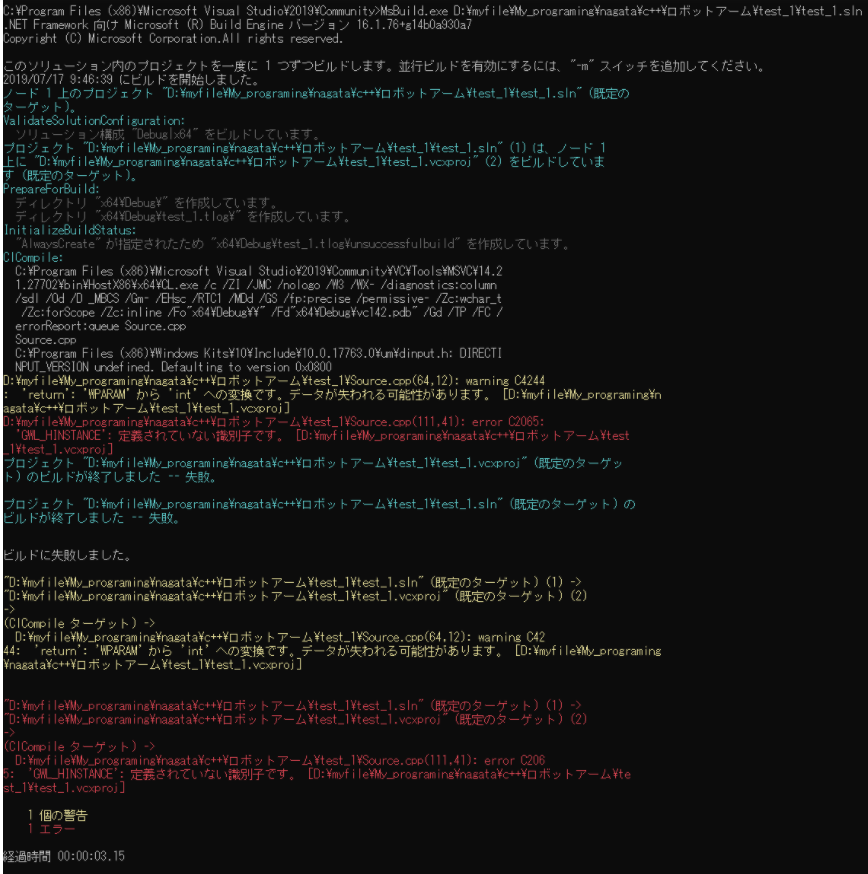
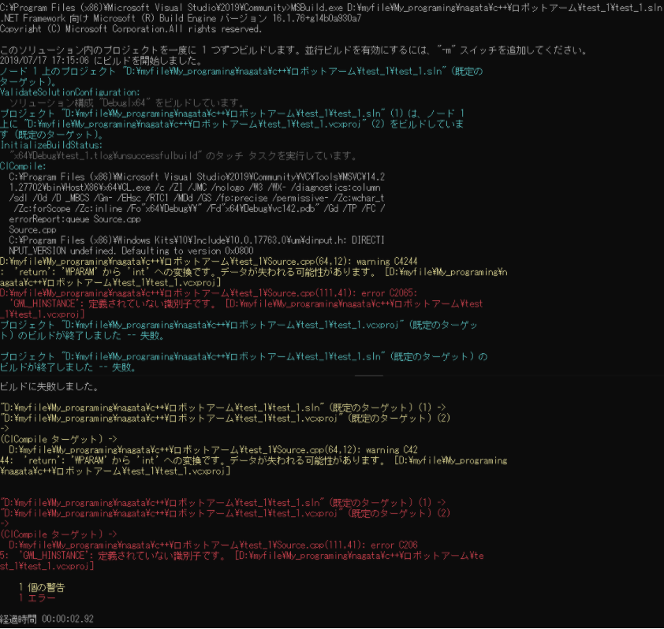

# 昨日の続き

昨日、最後にプログラムのコンパイルを行ったところ、MSB6006なるエラーが発生し、作業が中断された。そのため、本日はこのエラーの削除から行おうと思う。

# エラー番号：MSB6006

エラー内容をコピーし検索したところ、このエラー原因には様々なものがあることが分かった。

また、以下のサイトにエラー内容の詳細を表示する方法が記載されていなので試してみた

https://social.msdn.microsoft.com/Forums/ja-JP/eb7bf082-aae6-431c-b07d-ad8a213fcc5e/12456125211254012288msb6006?forum=vcgeneralja

結果は、以下に示す通りである。

# エラー番号：C2065

エラーの詳細を表示したところ、C2065というエラーが原因でコンパイルできていなことが分かった。

こちらは、一般に識別子が宣言されていなことが原因で発生するエラーである。識別子が宣言されていない原因は、スペルミスやヘッダファイルが読み込まれていない場合に発生する。

Visual Studio Installerを確認したところ『C++によるゲーム開発』の項目を選択しても、DirextXのSDKのインストール項目が確認できなかったことから、SDKが自動的にインストールされていないと判断した。

## 仮定1

このことから、SDKをMicrosoft公式サイトからダウンロードし、ファイルパスを指定することでエラーが解決すると思われる

## 検証1

参考HP : https://qiita.com/nisoka/items/f501a6cc7bc3636611c4

上記の方法に則りDXSDKをインストールした。

....検証中止（インストールは実行しなかった

# 新しいルートの模索

参考HP : http://www.northbrain.org/book/DirectXSDK.html

上記のサイト中盤にて

> DirectX SDKについて
>
> 以前はVisual Studio(以下 VS)とは別にDirectX SDKを入手する必要がありましたが、現在はVSをインストールするとDirectX SDKも自動的にインストールされます。
>
> 従いまして、VSをインストール完了した時点で必要なものは全て揃うことになります。

という記事を見つけた。

## 仮定2

このことから、現在のVSでは『インクルードディレクトリ』および『ライブラリディレクトリ』にパスを通すことで、簡単にDirectX のヘッダファイルとdllファイルを読み込むことが可能であると考える。

## 検証2

上記のサイトに則り2つのライブラリにそれぞれディレクトリを追加した。また、コンパイル時に参照されるwindowsSDKが変更される可能性を考慮して、windowsSDKバージョンを10.0.17763.0とした。以下に設定したwindowsSDKおよびそれぞれのディレクトリパスを記載する。

* windowsSDK バージョン：10.0.17763.0

* インクルードディレクトリ：

C:\Program Files (x86)\Windows Kits\10\Include\10.0.17763.0\shared

C:\Program Files (x86)\Windows Kits\10\Include\10.0.17763.0\um

* ライブラリディレクトリ

C:\Program Files %28x86%29\Windows Kits\10\Lib\10.0.17763.0\ucrt\x64

C:\Program Files (x86)\Windows Kits\10\Lib\10.0.17763.0\um\x64

## 結論2

2つのディレクトリにパスを通してみたところ、先ほどまで見られなかったエラーが大量に発生した。パッと見た感じでは、stdio.hがインクルードできなくなっていた。そのため、SDKのバージョンを規定の『10.0(最新のインストールされているバージョン)』に戻したり、追加したディレクトリのパスを削除したりしてみたが、結果としてエラーは消えるどころか、むしろ増えていった。

あくまで元に戻す方法として、『インクルードディレクトリ』および『ライブラリディレクトリ』を《親またはプロジェクトの規定値から継承》に設定した。これによりエラーは最初と同じMSB6006のみが残るようになった。

# 再びSDKインストールへ

サイトの最後の項目に、『DirectX SDKのインストール』があった。どうもDX SDKだけでなくそのヘッダも扱う場合は、別途インストールする必要があるらしい。

## SDKのインストール

検証1のサイトを再度参考にしながら、DirectX SDK June2010 のインストールを行った。

サイトの途中にはインストールエラーが出た場合の対処が書かれているが、今回行った限りではエラーは発生しなかった。

インストール終了後、2つのディレクトリにパスを通しコンパイルを行ってみたところ、エラーは変化しなかった。

## 検証

そこで、再度コマンドプロンプトよりコンパイルを行い、詳細なエラーを確認した。その結果を以下に示す。

# 結論

最初の表示結果と今回の表示結果を比べたが、エラー内容に変化は見られなかった。よって、DirectX SDKをインストールする必要性はない可能性と思われる（要検証）。しかし、根本的なにエラーの解消にはつながらなかった。そのため、C2065のエラーについて別の原因を探ることとする。
