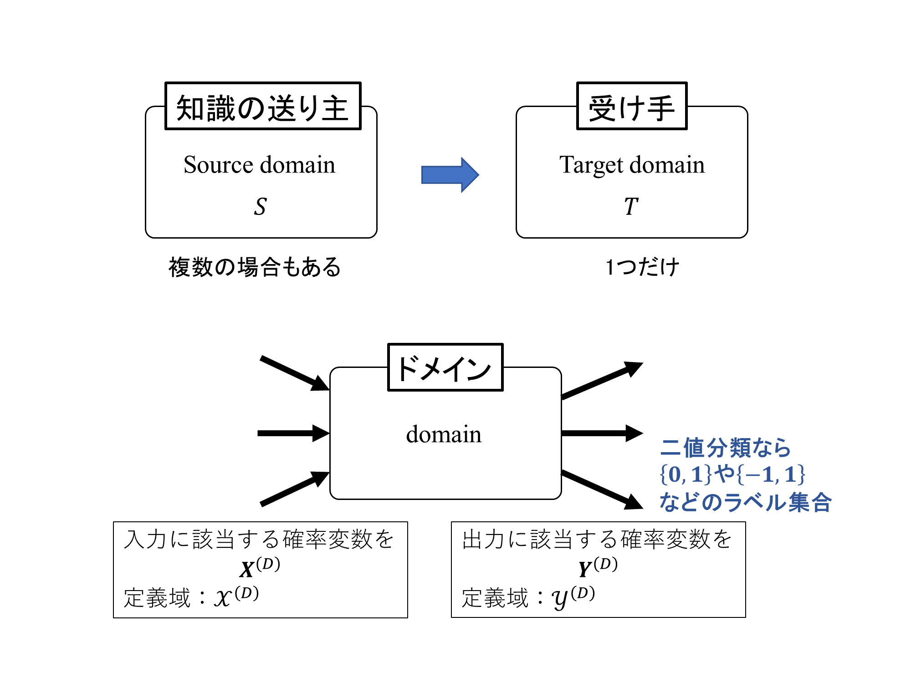

# 転移学習

## 転移学習とは

新規タスクの効果的な仮説を効率的に見つけ出すために、1つ以上の別のタスクで学習された知識を得て、それを適用する問題。

すなわち、ある問題を効果的かつ効率的にとくために別の関連したデータや学習結果を再利用するのが転移学習

## 転移学習の目標

関連しているが異なる部分もあるデータから、目的の問題にも利用できる情報・知識だけを取り込んで、より予測精度の高い規則を得る。

## 転移学習が有効な問題

教示情報が不要な教師なし学習で獲得できる言語モデルなどは格段に精度が向上。

一方、音声認識の音響モデルや文章分類のモデルなどはそれほど向上しない。

この理由として、教示付き学習データを大量に用意することが困難であるといった課題が挙げられる。

そのため、機械学習では次のような方法で精度の向上を図っている。

* 半教師あり学習(少数のラベルありデータ + 多数のラベルなしデータ)

* 能動学習(より効率的な分離ができるよう選んだ事例に対して、教示情報を与えさせる)

* 転移学習

# 表記

