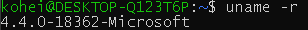
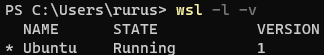
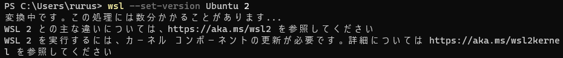
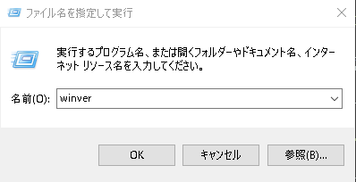
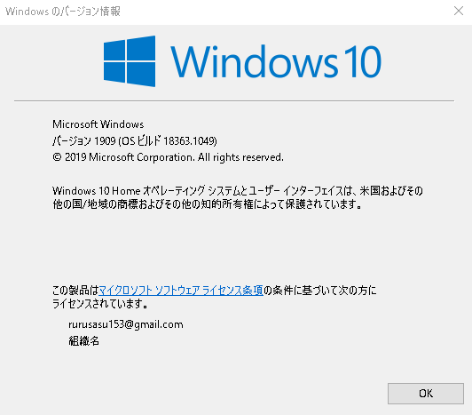
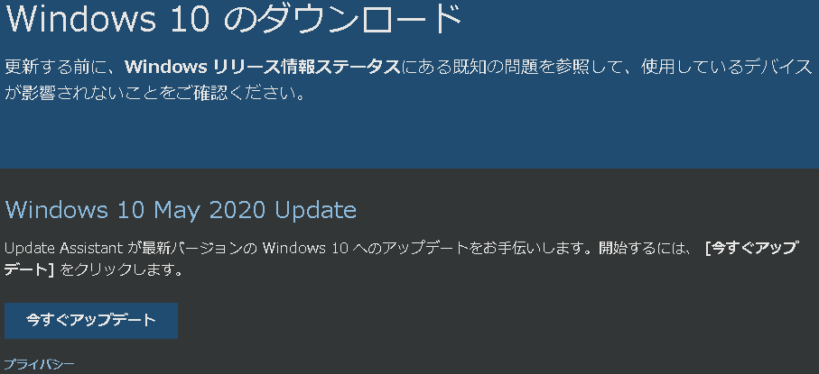

# WSL + docker + GPU

## 1.1 Ubuntu 20.04.1 LTS をインストール

Microsoft Store より、Ubuntu をインストール


## 1.2 Ubuntu 初期設定

ユーザ名とパスワードを設定

パッケージアップデート

```
sudo apt update
sudo apt upgrade
```

# WSL kernel update

## 2.1 WSL kernenl の確認

WLA2 の正しいカーネルで動作しているかを確認

```
uname -r
```



**4.19.121-microsoft-WSL2-standard**と表示されれば成功らしいが.....

明らかに文字数が少ないので、少し調べてみた。

コマンドプロンプトにて、現在の Ubuntu が動作している WSL のバージョンを確認

```
wsl -l -v
```



WSL のバージョンがやはり、1 だった.....

## 2.2 kernel update

このバージョンを 2 に変更する

```
wsl --set-version Ubuntu 2
```



カーネルの viersion が古かったのか、その更新を要求された。

また、Ubuntu を起動した状態だと、


このように、Ubuntu が強制終了された。

先ほどのサイトから WSL.exe のアップデートファイルをダウンロードすることができた。


しかし、コマンドラインでアップデートを行いたかったので、今回はこちらは使用しなかった。

## コマンドラインでの WSL2 のアップデート

windows のバージョンを確認





目的の「version 2004，build 19041 以上」になっていなければ WSL2 は使えないが、現在の windows の version は「version 1909 build 18363」なので、まずこちらのアップデートを行わなければならない。

### Windows 10 のダウンロード

windows の更新プログラムでは「version 2004」にアップデートできなかったので、次のサイトから更新プログラムをダウンロードする。

https://www.microsoft.com/ja-jp/software-download/windows10


