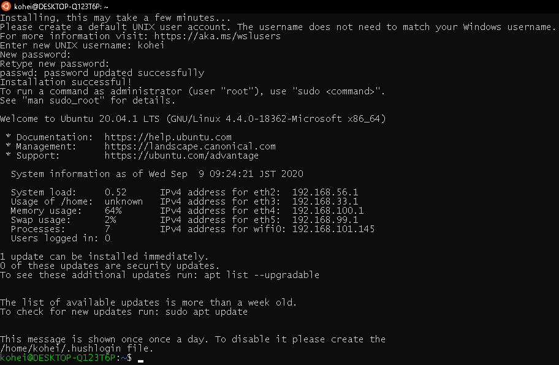
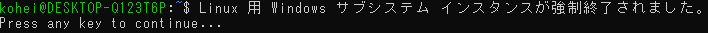

<!--
theme: default
size: 4:3
page_number: true
paginate: true
header: "2020年9月9日"
style: |

  section {
    font-size: 20px;
  }

  header {
    width: 100%;
    font-size: 20px;
    color: black;
    padding: 1px;
    top: 50px;
  }

  footer {
    width: 100%;
    font-size: 20px;
    color: black;
    text-align: right;
    padding: 15px;
  }

  h1 {
    font-size: 40;
    color: navy;
  }

  h2 {
    font-size: 35;
    color: navy;
  }

  h3 {
    font-size: 30;
    color: navy;
  }

  pre, code{
    font-size: 18px;
  }
-->

# WSL + docker + GPU

## 1.1 Ubuntu 20.04.1 LTS をインストール

Microsoft Store より、Ubuntu をインストール

## 1.2 Ubuntu 初期設定

ユーザ名とパスワードを設定

パッケージアップデート

```
sudo apt update
sudo apt upgrade
```

---



---

# WSL kernel update

参考：[WSL2 で docker-compose を使えるようにするまで](https://qiita.com/suaaa7/items/744f58319c04d9b6bfbe)

## 2.1 WSL kernenl の確認

WLA2 の正しいカーネルで動作しているかを確認

```
uname -r
```


**4.19.121-microsoft-WSL2-standard**と表示されれば成功らしいが.....

---

明らかに文字数が少ないので、少し調べてみた。

コマンドプロンプトにて、現在の Ubuntu が動作している WSL のバージョンを確認

```
wsl -l -v
```


WSL のバージョンがやはり、1 だった.....

---

## 2.2 kernel update

このバージョンを 2 に変更する

```
wsl --set-version Ubuntu 2
```


カーネルの viersion が古かったのか、その更新を要求された。

また、Ubuntu を起動した状態だと、



このように、Ubuntu が強制終了された。

---

先ほどのサイトから WSL.exe のアップデートファイルをダウンロードすることができた。


しかし、コマンドラインでアップデートを行いたかったので、今回はこちらは使用しなかった。

---

### 2.3.1 コマンドラインでの WSL2 のアップデート

参考サイト：[WSL2 導入](https://qiita.com/tomokei5634/items/27504849bb4353d8fef8)

windows のバージョンを確認


---


目的の「version 2004，build 19041 以上」になっていなければ WSL2 は使えない。

現在の windows の version は「version 1909 build 18363」なので、まずこちらのアップデートを行わなければならない。

---

### 2.3.2 Windows 10 のダウンロード

windows の更新プログラムでは「version 2004」にアップデートできなかったので、次のサイトから更新プログラムをダウンロードする。

https://www.microsoft.com/ja-jp/software-download/windows10


---

windows の versoin が 2004 になっていることを確認


再度、Ubuntu の version を確認する。

```
wsl -l -v
```


---

windows を更新しただけでは、kernel version はアップデートされていなかったので、再度 versionup を試みる。

```
wsl --set-version Ubuntu 2
```


しかし、これでも同じ結果になった。

---

### 2.3.3 WSL 2 に更新する

WSL 2 に更新するための条件を次に示す。


---

> WSL 2 をインストールする前に、"仮想マシンプラットフォーム" オプション機能を有効にする必要があります。\
> 管理者として PowerShell を開き、以下を実行します。

```PowerShell
dism.exe /online /enable-feature /featurename:VirtualMachinePlatform /all /norestart
```


---

### 2.3.4 WSL 2 を基底の version として設定する

> PowerShell で次のコマンドを実行して、新しい Linux ディストリビューションをインストールするときに WSL 2 を既定の verion として設定する。

```PowerShell
wsl --set-default-version 2
```

ダメ....


---

## 2.4 wsl_update_x64.msi を使う

結局、wsl_update_x64.msi を使うことに。

[https://aka.ms/wsl2kernel](https://docs.microsoft.com/en-us/windows/wsl/wsl2-kernel)にアクセスし、`wsl_update_x64.msi`をダウンロードする。


.msi ファイルを実行すると、以下の画面が表示されるので、「Next」を選択。


すぐにアップデートが開始される。

---

### 2.4.1 再度 WSL 2 を基底の version として設定する

再度、以下のコマンドをコマンドプロンプトに打ち込み、WSL 2 が正常に交換されるか確認。

```PowerShell
wsl --set-default-version 2
```


今度はエラーが表示されず、正常に交換された模様。

しかし、デフォルトの kernel を変更しても、既に動作している WSL の Version は変わらないらしい。


---

よって、下記のコマンドを再々度打ち込む

```PowerShell
wsl --set-default-version 2
```


ようやく WSL の version が 2 に変更された。


Ubuntu 側でも、しっかりと WSL 2 で動作していることを確認


**4.19.121-microsoft-WSL2-standard**ではなく、

**4.19.104-microsoft-standard**と表示されたので失敗.......

---

## 2.5 Windows Insider Program

4.19.121 以上の version は、[github](https://docs.microsoft.com/ja-jp/windows/wsl/kernel-release-notes)上に存在したが、コンパイルを行う必要があったため、断念......

そこで、windows の Insider Program に加入し、Linux krenel のアップデートを行うことにした。

---

### 診断とフィードバックの変更

Windows Insider Program に加入するためには、診断 & フィードバックデータの取得を「完全」に設定する必要がある。

しかし、Windows のアップデートの影響なのか、「完全」の欄が消えていたため、オプションの診断データを選択。


その結果、Windows Insider Program に加入することができた。


Insider Program には、3 つの選択肢があるが、今回はリリースプレビューを選択した。


その結果、無事 Linux kernel 4.19.128 をダウンロードすることができた。


最後に、Ubuntu 上でも確認を行う。


---

## 4 NVIDIA Drivers for CUDA on WSL のインストール

以下のリンクから、NVIDIA Driver をインストールする。

https://developer.nvidia.com/cuda/wsl/download


ダウンロードした exe ファイルを起動し、適当なフォルダにインストールする。


## 5 一端、Ubuntu の設定を再開

ダウンロードした Ubuntu にこちらの設定を行う

```
sudo sed -i 's/\/\/archive.ubuntu.com/\/\/jp.archive.ubuntu.com/g' /etc/apt/sources.list
sudo sed -i 's/\/\/us.archive.ubuntu.com/\/\/jp.archive.ubuntu.com/g' /etc/apt/sources.list
sudo sed -i 's/\/\/fr.archive.ubuntu.com/\/\/jp.archive.ubuntu.com/g' /etc/apt/sources.list
```

```
sudo apt update
sudo apt -yV upgrade
```

## 6 Ubuntu 上に Docker をインストールする

ここまで設定が終了したら、続いて Ubuntu 上に Docker をインストールする。

コマンドライン上に次のコマンドを打ち込む。

```
curl https://get.docker.com | sh
```


これが終わると、次に nvidia container toolkit をインストールする。

そのためにまず、リポジトリを追加する。

```
distribution=$(. /etc/os-release;echo $ID$VERSION_ID)
curl -s -L https://nvidia.github.io/nvidia-docker/gpgkey | sudo apt-key add -
curl -s -L https://nvidia.github.io/nvidia-docker/$distribution/nvidia-docker.list | sudo tee /etc/apt/sources.list.d/nvidia-docker.list
curl -s -L https://nvidia.github.io/libnvidia-container/experimental/$distribution/libnvidia-container-experimental.list | sudo tee /etc/apt/sources.list.d/libnvidia-container-experimental.list
```

追加が完了すると、このように「OK」と表示される。


※ 一度、コマンドラインに打ち込んでみたが、読み込まれていなかったのか、以下のコマンドが動作しないことがあった。


その際は、再度上のコマンドをコピペすることで、動作した。

そして、Ubuntu リポジトリを更新してから、Nvidia ランタイムをインストールする。

```
sudo apt update
sudo apt install -y nvidia-docker2
```

インストールに成功すると、このように大量の履歴が表示される。


実際の実行は、apt-get で行ったが、apt でも動作すると思われる。

## 6.1 動作確認

先ほどインストールした nvidia-docker2 を動作させて GPU が正常に動作してるかを確認してく。

まず、タスクバー上の Ubuntu アイコンを **Shift キーを押しながらクリックすることで、新しいウインドウを立ち上げる。**

新しいウインドウにて、以下のコマンドが動作するか確認

```
sudo service docker stop
sudo service docker start
```


正常に動作すると、「OK」が表示される。

## 6.2 GPU を動かしてみる

nvidia-docker2 を動作させていく。

```
docker run --gpus all nvcr.io/nvidia/k8s/cuda-sample:nbody nbody -gpu -benchmark
```

しかし、このコマンドを新しいウインドウに打ち込むと、以下のようなエラーが出た。


どうやら、docker コマンドはデフォルトでは root 権限でないと動かないらしい(一般ユーザでは動かせない)。

### 6.2.1 行った対応

参考：[「Got permission denied while trying to connect to the Docker daemon socket」への対応](https://qiita.com/ashidaka/items/734856443f922ff175b1)

一般ユーザを 「docker」 グループに追加する。

```
grep -i docker /etc/group
```


```
sudo gpasswd -a username docker
```

ここで、`username` は自分がログイン時に使っている `name` に変更する必要がある。


```
grep -i docker /etc/group
```


グループに入ったことを確認した後、一旦ログアウトを行い、再度ログインする。

docker start ・ stop には、root 権限が必要らしい。


その後、ベンチマークのコンテナを run


エラー.....

root 権限なしで動作はできるようになったが、別の問題が発生した模様。

今日はここまで....
