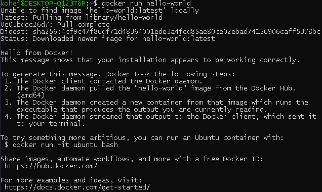

# WSL + docker + GPU (2)

## 1.1. ベンチマークが動作するようになるまで

まず，docker が動作しているかを確認するため，以下のコマンドを実行

```
docker run hello-world
```

その結果，docker は正常に動作していることを確認した．



---

## 1.2. nvidia-docker2.0

一度 nvidia-docker2.0 について調べてみることにした．

参考

- [nvidia-docker コンテナ Deep Learning](https://blog.idcf.jp/entry/nvidia-docker#nvidia-docker-20)

- [nvidia docker って今どうなってるの？(19.11 版)](https://qiita.com/ksasaki/items/b20a785e1a0f610efa08)

- [nvidia docker って今どうなってるの？(20.09 版)](https://medium.com/nvidiajapan/nvidia-docker-%E3%81%A3%E3%81%A6%E4%BB%8A%E3%81%A9%E3%81%86%E3%81%AA%E3%81%A3%E3%81%A6%E3%82%8B%E3%81%AE-20-09-%E7%89%88-558fae883f44)

その結果，このプロジェクト名は既に NVIDIA Docker ではないことを知った．

---

## 1.3. NVIDIA Docker の歴史

### 1.3.1. 誕生からバージョン 1.0.1 まで

第一世代の NVIDIA Docker は，標準の `docker` コマンドとは別に `nvidia-docker` というコマンドが提供されていた．

ホスト側の CUDA 関連ファイルをコンテナで利用かのうにするために，nvidia-docker-plugin という Docker ボリュームプラグラインのデーモンが動いており，`nvidia-docker` コマンドはこのデーモンと通信してコンテナで GPU を使うための環境を整えていた．

この頃はまだパッケージのリポジトリを公開しておらず，.deb や .rpm ファイルを直接配布していた．

---

### 1.3.2. バージョン 2.0.2 から 2.1.1 まで

このバージョンが，いわゆる 「NVIDIA Docker 2」．

nvidia-docker2 パッケージでインストール可能に．

第 1 世代とはアーキテクチャが変わり，コンテナ実行時は `docker run --runtime=nvidia` として NVIDIA によるカスタマイズ版の runc を指定する形になった．`nvidia-docker` コマンドは `--runtime=nvidia` オプションなどを補って `docker` コマンドを実行するラッパースクリプトとして残った．

プロジェクトの名称は，当初 "_Docker Engine Utility for NVIDIA GPUs_" で，後に "_NVIDIA Container Runtime for Docker_" に変わった．

---

### 1.3.3. バージョン 2.2.1 以降

Docker 19.03 が GPU をサポートし `--gpus` オプションが追加されたことに対応したのがこの世代．名称は "_NVIDIA Container Toolkit_" になった．引き続き，nvidia-docker2 パッケージでインストールできるが，パッケージ構成が以前と少し異なる．

2020 年 9 月現在，この [NVIDIA Container Toolkit](https://github.com/NVIDIA/nvidia-docker#nvidia-container-toolkit) が最新の「NVIDIA Docker」 です．


---

## 1.4. 環境構築方法

次の 3 つのステップで環境構築を行う．

1. NVIDIA ドライバのインストール
2. Docker のインストール
3. NVIDIA Container Toolkit のインストール

### 1.4.1. NVIDIA ドライバのインストール

オススメの方法は，NVIDIA 提供の cuda-drivers パッケージを使用すること．

> The recommended way is to use your package manager and install the cuda-drivers package (or equivalent).
>
> When no packages are available, you should use an official "runfile".

適当約：「オススメの方法はご利用の環境に応じた応じたパッケージマネージャで cuda-drivers パ kk－次 (あるいはその相当品) をインストールすることです．パッケージが利用できない場合に，公式の "runfile" を使ってください．」

cuda-drivers パッケージをインストールする場合， まず [CUDA Toolkit の web サイト](https://developer.nvidia.com/cuda-toolkit) にアクセスする．

---

<dev align="center">

</dev>

そこで，自分が欲しいディストリビューションに合わせてダウンロードするファイルを選択する．

<dev align="center">

</dev>

---

ここで，最後の行を

```
sudo apt-get -y install cuda-drivers
```

とすると，最新のドライバだけがきれいにインストールされる．以下，CUDA Toolkit に記されていた通りにインストールする．

```
$ wget https://developer.download.nvidia.com/compute/cuda/repos/ubuntu2004/x86_64/cuda-ubuntu2004.pin
$ sudo mv cuda-ubuntu2004.pin /etc/apt/preferences.d/cuda-repository-pin-600
$ wget https://developer.download.nvidia.com/compute/cuda/11.0.3/ \
local_installers/cuda-repo-ubuntu2004-11-0-local_11.0.3-450.51.06-1_amd64.deb
$ sudo dpkg -i cuda-repo-ubuntu2004-11-0-local_11.0.3-450.51.06-1_amd64.deb
$ sudo apt-key add /var/cuda-repo-ubuntu2004-11-0-local/7fa2af80.pub
$ sudo apt update
$ sudo apt -y install cuda-drivers
```

---


---


今日はここまで．
