# WSL + docker + GPU (3)

## 1. Docker のインストール

[Docker 公式の便利スクリプト](https://docs.docker.com/engine/install/ubuntu/#install-using-the-convenience-script)で、最新の安定板をすぐにインストールで着る。インストール後の Docker サービスの開始と、自動起動設定をしておく。

### 1.1. Uninstall old versions

```
sudo apt remove docker docker-engine docker.io containerd runc
```

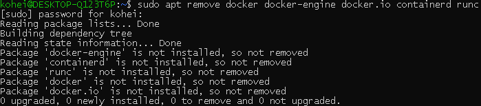

---

### 1.2. SET UP THE REPOSITORY

1. 以下のコマンドで、必要なリポジトリを追加する。

```
sudo apt update

sudo apt install \
    apt-transport-https \
    ca-certificates \
    curl \
    gnupg-agent \
    software-properties-common
```

<dev align="center">

</dev>

---

2. Docker の official GPG key を追加する。

```
curl -fsSL https://download.docker.com/linux/ubuntu/gpg | sudo apt-key add -
```

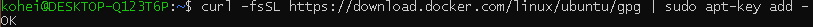

fingerprint の最後の 8 文字を検索して、手元の key が `9DC8 5822 9FC7 DD38 854A E2D8 8D81 803C 0EBF CD88` であることを確認する。

```
sudo apt-key fingerprint 0EBFCD88
```

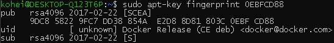

3. 次のコマンドを使用して、安定したリポジトリを追加する。nightly または test リポジトリを追加するには、以下のコマンドで stable という単語の後に nightly または test (または両方) という単語を追加する。

今回は、`x86_64 / amd64` を使用する。

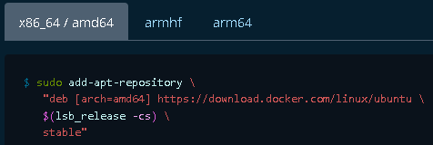

```
sudo add-apt-repository \
   "deb [arch=amd64] https://download.docker.com/linux/ubuntu \
   $(lsb_release -cs) \
   stable"
```

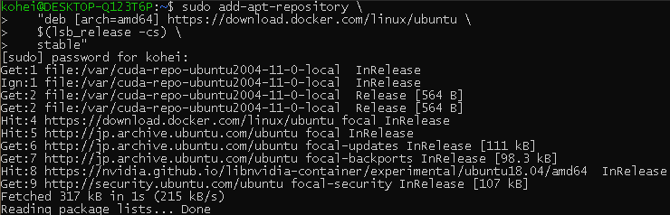

### 1.3 INSTALL DOCKER ENGINE

1. apt パッケージインデックスを更新し、Docker Engine と containerd の最新バージョンをインストールするか、次の手順に進んで特定のバージョンをインストールする。

```
sudo apt update

sudo apt install docker-ce docker-ce-cli containerd.io
```

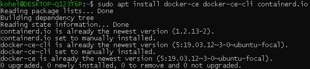

2. Docker Engine の特定のバージョンをインストールするには、利用可能なバージョンをリポジトリにリストしてから、選択してインストールします。

- リポジトリで利用可能なバージョンを一覧表示します。

```
apt-cache madison docker-ce
```

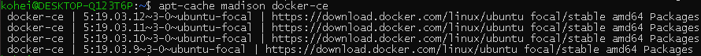

- 2 番目の列のバージョン文字列 `5:19.03.11~3-0~ubuntu-focal` を使用して、特定のバージョンをインストールする場合は、以下のコマンドの `<VERSION_STRING>` 部分をそのバージョン文字列に置き換えて使用する。

```
sudo apt-get install docker-ce=<VERSION_STRING> docker-ce-cli=<VERSION_STRING> containerd.io
```

3. hello-world イメージを実行して、Docker エンジンが正しくインストールされていることを確認します。

```
sudo service docker stop

sudo service docker start

sudo docker run hello-world
```

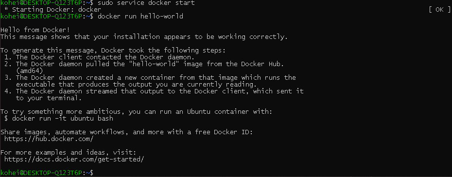

4. docker サービスの開始と自動起動設定

docker サービスの開始と、自動起動設定をする。

```
curl https://get.docker.com | sh

sudo systemctl start docker && sudo systemctl enable docker
```

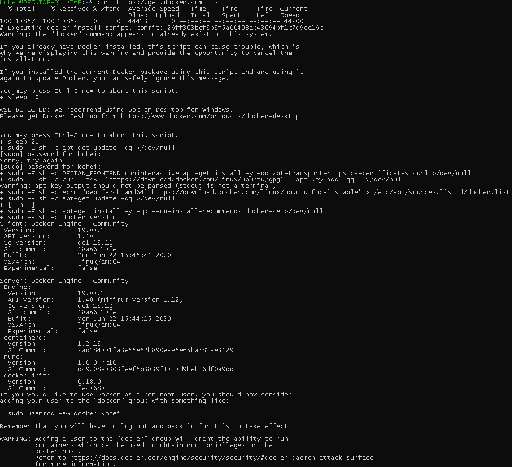

sudo なしに dokcer コマンドを実行可能にするため、次のように対象ユーザを dokcer グループに追加する。

実際に使用する場合は、`$USER` 部分を現在使用している `$USER` 名に変更する。

```
sudo usermod -aG docker $USER
```

### 1.4 NVIDIA Container Toolkit のインストール

> 2020 年 9 月 の更新により、nvidia-docker2 パッケージのインストールがとてもシンプルになった。

ここからは、nvidia の[公式ドキュメントのインストールガイド](https://docs.nvidia.com/datacenter/cloud-native/container-toolkit/install-guide.html#installing-docker-ce) に従い、NVIDIA Container Toolkit のインストールを行う。

1. 安定したリポジトリと GPG キーを設定します。

```
distribution=$(. /etc/os-release;echo $ID$VERSION_ID)

curl -s -L https://nvidia.github.io/nvidia-docker/gpgkey | sudo apt-key add -

curl -s -L https://nvidia.github.io/nvidia-docker/$distribution/nvidia-docker.list | sudo tee /etc/apt/sources.list.d/nvidia-docker.list
```

> WSL の CUDA や A100 の新しい MIG 機能などの実験的機能にアクセスするには、実験的ブランチをリポジトリリストに追加できます。

```
curl -s -L https://nvidia.github.io/nvidia-container-runtime/experimental/$distribution/nvidia-container-runtime.list | sudo tee /etc/apt/sources.list.d/nvidia-container-runtime.list
```

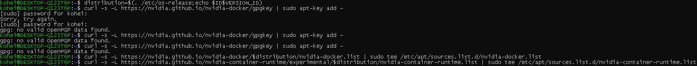

2 つ目の GPG は、追加することができなかった。

2. パッケージリストを更新した後、nvidia-docker2 パッケージ（および依存関係）をインストールします。

```
sudo apt-get update

sudo apt-get install -y nvidia-docker2
```

しかし、やはりリポジトリの追加が上手く行っていないのか、エラーが出た。

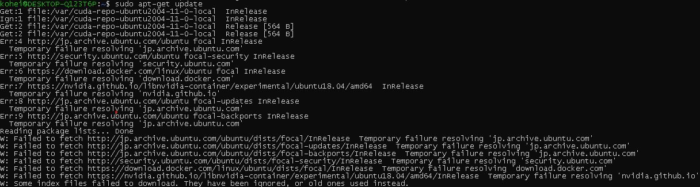

一応、`nvidia-docker2` のインストールも試みたが、こちらは一度インストールしていたため、次のような文章が表示された。

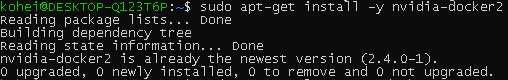

3. デフォルトのランタイムを設定した後、Docker デーモンを再起動してインストールを完了します。

```
sudo systemctl restart docker
```

これまたエラー........

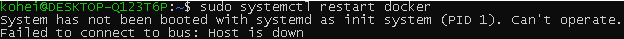

4. この時点で、ベースの CUDA コンテナーを実行することで、機能しているセットアップをテストできます。

```
sudo docker run --rm --gpus all nvidia/cuda:11.0-base nvidia-smi
```

これでインストール終了のはずだが....

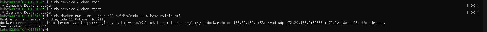

`Docker stop` ， `Docker start` を使用しても動作させることができなかった。

今日はここまで....
