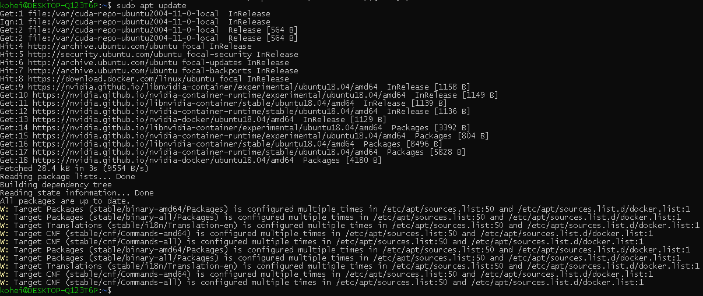
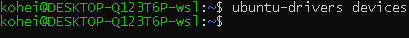

# WSL + docker + GPU (4)

そろそろ環境構築を終わらせたいので、一度いままでの内容をまとめようと思う。

## 参考

- [nvidia-docker コンテナ Deep Learning](https://blog.idcf.jp/entry/nvidia-docker#nvidia-docker-20)

- [nvidia docker って今どうなってるの？(19.11 版)](https://qiita.com/ksasaki/items/b20a785e1a0f610efa08)

- [nvidia docker って今どうなってるの？(20.09 版)](https://medium.com/nvidiajapan/nvidia-docker-%E3%81%A3%E3%81%A6%E4%BB%8A%E3%81%A9%E3%81%86%E3%81%AA%E3%81%A3%E3%81%A6%E3%82%8B%E3%81%AE-20-09-%E7%89%88-558fae883f44)

# 1. 環境構築

## 1.1. Ubuntu の初期設定

まずパッケージのアップデートを行う。

```
sudo apt update

sudo apt upgrade
```

## 1.2. WSL kernel update

`WSL2` のカーネル `4.19.121-microsoft` 以上で動作しているかを確認する。

```
uname -r
```


もし、`4.19.121-microsoft` より低い version で WSL が動作している場合は、[このページ](https://github.com/rurusasu/Diary/blob/master/2020_0909.pdf)を参考に、kernel を version up する。

## 1.3. NVIDIA ドライバのインストール

[CUDA Toolkit の web サイト](https://developer.nvidia.com/cuda-toolkit) にアクセスし、自分が欲しいディストリビューションに合わせたダウンロードファイルを選択する。


ここで、最後の行を

```
sudo apt-get -y install cuda-drivers
```

とすると、最新のドライバだけがきれいにインストールされる。

以下、CUDA Toolkit に記された通りにインストールする。

```
wget https://developer.download.nvidia.com/compute/cuda/repos/ubuntu2004/x86_64/cuda-ubuntu2004.pin

sudo mv cuda-ubuntu2004.pin /etc/apt/preferences.d/cuda-repository-pin-600

wget https://developer.download.nvidia.com/compute/cuda/11.0.3/local_installers/cuda-repo-ubuntu2004-11-0-local_11.0.3-450.51.06-1_amd64.deb

sudo dpkg -i cuda-repo-ubuntu2004-11-0-local_11.0.3-450.51.06-1_amd64.deb

sudo apt-key add /var/cuda-repo-ubuntu2004-11-0-local/7fa2af80.pub

sudo apt update

sudo apt -y install cuda-drivers
```


## 1.4. Docker のインストール

[Docker 公式のサイト](https://docs.docker.com/engine/install/ubuntu/#install-using-the-convenience-script)の手順に従って、Docker をインストールする。

1. まず、古い version の Docker をアンインストールする。

```
sudo apt remove docker docker-engine docker.io containerd runc
```

2. 以下のコマンドで必要なリポジトリを追加する。

```
sudo apt update

sudo apt install \
    apt-transport-https \
    ca-certificates \
    curl \
    gnupg-agent \
    software-properties-common
```


3. Docker の official GPG key を追加する。

```
curl -fsSL https://download.docker.com/linux/ubuntu/gpg | sudo apt-key add -
```

4. fingerprint の最後の 8 文字を検索して、手元の key が `9DC8 5822 9FC7 DD38 854A E2D8 8D81 803C 0EBF CD88` であることを確認する。

```
sudo apt-key fingerprint 0EBFCD88
```


5. 次のコマンドを使用して、安定したリポジトリを追加する。nightly または test リポジトリを追加するには、以下のコマンドで stable という単語の後に nightly または test (または両方) という単語を追加する。

今回は、`x86_64/amd64` を使用する。


```
sudo add-apt-repository \
   "deb [arch=amd64] https://download.docker.com/linux/ubuntu \
   $(lsb_release -cs) \
   stable"
```


6. apt パッケージインデックスを更新し、Docker Engine と containerd の最新バージョンをインストールするか、7. の⼿順に進んで特定のバージョンをインストールする。

```
sudo apt update

sudo apt install docker-ce docker-ce-cli containerd.io
```

先ほどのコマンドを実行すると、次のような画面が表示された。


初めて見るエラーだったので、少し調べてみた。

> GRUB
>
> GRUB とは、コンピュータの起動時に最初に読み込まれ、ストレージなどからオペレーティングシステム（OS）を読み込んで起動するブートローダの一つ。GNU プロジェクトが開発・公開しているオープンソースソフトウェアで、よく Linux と組み合わせて用いられる。
> [e-Words より]

画面については、以下を参考にした。

[Windows10 Update が来たので WSL2 で Ubuntu 20.04 LTS を起動し Docker をインストール](https://qiita.com/toyotoyo_/items/895c07fb50708b013eba)

7. Docker Engine の特定のバージョンをインストールするには、利⽤可能なバージョンをリポジトリにリストしてから、選択してインストールします。

- まず、リポジトリで利用可能なバージョン一覧を表示する。

```
apt-cache madison docker-ce
```


- 2 番⽬の列のバージョン⽂字列 `5:19.03.11~3-0~ubuntu-focal` を使⽤して、特定のバージョンをインストールする場合は、以下のコマンドの `<VERSION_STRING>` 部分をそのバージョン⽂字列に置き換
  えて使⽤する。

```
sudo apt install docker-ce=<VERSION_STRING> docker-ce-cli=<VERSION_STRING>
containerd.io
```

8. docker イメージを実行するために、docker deamon を起動します。

```
sudo service docker start
```


9.  hello-world イメージを実⾏して、Docker エンジンが正しくインストールされていることを確認しま
    す。

```
sudo docker run hello-world
```


10. `hello-world` のメッセージが表示されたことを確認したら、docker グループにユーザを追加しておく。docker はデフォルトだと root 権限がないユーザからの操作を受け付けないが、こうすることで、`sudo` なしに、`docker run` コマンドを使用できるようになる。

- ユーザ追加前の、docker グループを確認する。

```
grep -i docker /etc/group
```

- ユーザを dokcer グループに追加する。ここで、`$USER` は自分がログイン時に使っているユーザ名に変更する必要がある。

```
sudo usermod -aG docker $USER
```


11. グループに入ったことを確認した後、一旦ログアウトを行い、再度ログインする。

```
logout
```

12. docker サービスの開始と自動起動設定をする。

```
curl https://get.docker.com | sh

sudo systemctl start docker && sudo systemctl enable docker
```

これを実行すると、最後に次のような文章が表示される。

> If you would like to use Docker as a non-root user, you should now consider adding your user to the "docker" group with something like:
>
> sudo usermod -aG docker kohei
>
> Remember that you will have to log out and back in for this to take effect!

適当訳：

Docker を非 root ユーザーとして使用したい場合は、ここで検討する必要があります。
次のようにして、ユーザーを「docker」グループに追加します。

`sudo usermod -aG docker kohei`

これを有効にするには、ログアウトしてから再度ログインする必要があることに注意してください。

> WARNING: Adding a user to the "docker" group will grant the ability to run containers which can be used to obtain root privileges on the docker host. Refer to https://docs.docker.com/engine/security/security/#docker-daemon-attack-surface for more information.

適用訳：

警告：「docker」グループにユーザーを追加すると、Docker ホストで root 権限を取得するために使用できるコンテナーを実行する機能が付与されます。 詳細については、https：//docs.docker.com/engine/security/security/#docker-daemon-attack-surface を参照してください。


このような警告が表示されたため、一応 docker グループにユーザ登録されているかを確認する。

```
grep -i docker /etc/group
```


しっかりと、登録されたままの状態となっていることを確認。

13. 起動確認

最後に起動確認を行う。

```
docker -ps
```

このようにエラーが出なければ OK


## 1.5. NVIDIA Container Toolkit のインストール

nvidia の[公式ドキュメントのインストールガイド](https://docs.nvidia.com/datacenter/cloud-native/container-toolkit/install-guide.html#installing-docker-ce) に従い、NVIDIA Container Toolkit のインストールを行う。

1. Version 1.0 の `nvidia-docker` がインストールされていないかを確認する。

```
docker volume ls -q -f driver=nvidia-docker | xargs -r -I{} -n1 docker ps -q -a -f volume={} | xargs -r docker rm -f
```

インストールされていれば、以下のコマンドでアンインストールする。

```
sudo apt purge nvidia-docker
```

一応、確認のため実行してみたが、インストールされていなかったので、エラーが出た。


2. 安定したリポジトリと GPG キーを設定する。

```
distribution=$(. /etc/os-release;echo $ID$VERSION_ID)

curl -s -L https://nvidia.github.io/nvidia-docker/gpgkey | sudo apt-key add -

curl -s -L https://nvidia.github.io/nvidia-docker/$distribution/nvidia-docker.list | sudo tee /etc/apt/sources.list.d/nvidia-docker.list
```


> WSL の CUDA や A100 の新しい MIG 機能などの実験的機能にアクセスするには、実験的ブランチをリポジトリリストに追加できます。

```
curl -s -L https://nvidia.github.io/nvidia-container-runtime/experimental/$distribution/nvidia-container-runtime.list | sudo tee /etc/apt/sources.list.d/nvidia-container-runtime.list
```


3. パッケージリストを更新した後、nvidia-docker2 パッケージ (および依存関係) をインストールします。

```
sudo apt update

sudo apt install -y nvidia-docker2
```



インストール完了！やっとここまで来た......


4. デフォルトのランタイムを設定した後、Docker デーモンを再起動してインストールが完了する。

```
sudo systemctl restart docker
```

しかし、ここにきてエラー....


## 1.6. PID 1 を `systemd` に変更する

インストールは上手くいってそうなので、別の理由かと思いつつ、調べてみた。

参考：[【WSL2】systemctl が動かない問題をきちんと解決する](https://shikiyura.com/2020/06/execute_systemctl_on_wsl2/)

```
System has not been booted with systemd as init system (PID 1). Can't operate.
Failed to connect to bus: Host is down
```

機械翻訳：

システムが systemd で init システム（PID 1）として起動されていません。 操作できません。
バスに接続できませんでした：ホストがダウンしています。

これは、`systemd` が `PID 1 (init system)` ではないので操作できないよ。みたいな感じ。

参考サイトによると

> Linux が起動するとき、すべてのプロセスの最初として「systemd」が起動し、すべてのプロセスの親としてふるまう。

実際に以下のコマンドで、WSL2 上のプロセスを確認してみると、PID 1 が `/init` になっており `systemd` ではないことが確認できる。

```
ps aux
```


これが、原因で `systemd` が動作していない模様...

そこで、以下のリポジトリを用いてこの問題を解決する。

https://github.com/arkane-systems/genie

※ この方法は、WSL2 でのみ適用可能。

1. パッケージを追加する。

```
curl -s https://packagecloud.io/install/repositories/arkane-systems/wsl-translinux/script.deb.sh | sudo bash
```


2. 以下のコマンドでインストールする。

```
sudo apt install -y systemd-genie
```

すると、次のようなエラーが表示される。


```
The following packages have unmet dependencies:
systemd-genie : Depends: dotnet-runtime-3.1 but it is not installable

E: Unable to correct problems, you have held broken packages.
```

機械翻訳：

> 次のパッケージには、満たされていない依存関係があります。
>
> systemd-genie：依存：dotnet-runtime-3.1 ですが、インストールできません。
>
> E：問題を修正できません。パッケージが壊れています。

そこで、依存関係の `dotnet-runtime-3.1` をインストールする。

```
sudo apt install dotnet-runtime-3.1
```

しかし、次のようなエラーが表示される。


```
Package dotnet-runtime-3.1 is not available, but is referred to by another package.
This may mean that the package is missing, has been obsoleted, or is only available from another source

E: Package 'dotnet-runtime-3.1' has no installation candidate
```

機械翻訳：

> パッケージ dotnet-runtime-3.1 は使用できませんが、別のパッケージによって参照されています。
> これは、パッケージが見つからないか、廃止されているか、別のソースからしか入手できないことを意味します。
>
> E：パッケージ 'dotnet-runtime-3.1'にはインストール候補がありません。

なんで、みんな落とせてるのよ....

Microsoft の [Ubuntu に .NET Core SDK または .NET Core ランタイムをインストールする](https://docs.microsoft.com/ja-jp/dotnet/core/install/linux-ubuntu#2004-) を参考に `dotnet-runtime-3.1` をインストールする。

- .Net をインストールする前に、次のコマンドを実行して、信頼された key の一覧に Microsoft パッケージ署名 key を追加し、パッケージリポジトリを追加する。

```
wget https://packages.microsoft.com/config/ubuntu/20.04/packages-microsoft-prod.deb -O packages-microsoft-prod.deb

sudo dpkg -i packages-microsoft-prod.deb
```

- `.Net Core` ランタイムを使用すると、ランタイムを含まない `.Net Core` を使用して作成されたアプリを実行することができる。次のコマンドを実行すると、`.Net Core` の最も互換性の高いランタイムである `ASP .Net Core` ランタイムをインストールできる。

```
sudo apt update; \
  sudo apt install -y apt-transport-https && \
  sudo apt update && \
  sudo apt install -y aspnetcore-runtime-3.1
```

これは、目的の `.Net Core runtime-3.1` ではないが、動作するか確認したかったので、一度インストールを試みた。

インストールは成功。


先ほど失敗した、`genie` のインストールも試してみる。

```
sudo apt install -y systemd-genie
```

結果、インストールに成功した。


3. インストールした `genie` を使って PID 1 を変更する。

`genie` をインストールしただけでは、PID に変化はなかった。


そのために、以下のコマンドを実行する。

```
genie -s
```

このコマンドを実行すると、PID 1 がしっかりと `systemd` に変化した。


## 1.7. Docker daemon を再起動

先ほどできなかった、`docker daemon`の再起動を行う。

```
sudo systemctl restart docker
```

結果は、別のエラー....


```
Job for docker.service failed because the control process exited with error code.
See "systemctl status docker.service" and "journalctl -xe" for details.
```

機械翻訳：

> 制御プロセスがエラーコードで終了したため、docker.service のジョブが失敗しました。
>
> 詳細については、「systemctl status docker.service」および「journalctl -xe」を参照してください。

docker のリスタートが行いたかったので、ここで一度再起動してみることに。

しかし、再起動すると PID 1 がまた `init` に戻ることが判明！


そのため、WSL2 では起動の度に

```
genie -s
```

コマンドを打たなければならない。

## 1.8. CUDA コンテナの実行

ベースの CUDA コンテナーを実⾏することで、機能しているセットアップをテストする。

```
sudo docker run --rm --gpus all nvidia/cuda:11.0-base nvidia-smi
```

しかし、次のようなエラーが発生。


```
docker: Error response from daemon: OCI runtime create failed: container_linux.go:349: starting container process caused "process_linux.go:449: container init caused \"process_linux.go:432: running prestart hook 0 caused \\\"error running hook: exit status 1, stdout: , stderr: nvidia-container-cli: initialization error: nvml error: driver not loaded\\\\n\\\"\"": unknown.
```

機械翻訳：

> docker：デーモンからのエラー応答：OCI ランタイムの作成に失敗しました：container_linux.go：
>
> 349：コンテナープロセスの開始により「process_linux.go：
>
> 449：コンテナーの初期化により\ "process_linux.go：
>
> 432：実行前開始フック 0 により\\\"エラーが発生しました。
>
> 実行中のフック：終了ステータス 1、標準出力：、標準エラー：nvidia-container-cli：初期化エラー：nvml エラー：ドライバーが読み込まれていません\\\\ n \\\ "\" "：不明です。

ドライバーが読み込まれていませんという文があることから、`nvidia-driver` が必要なのではないかと考えた。

そこで、以下のコマンドを実行する。

```
nvidia-sim
```

すると、次のようなメッセージが表示された。

```
NVIDIA-SMI has failed because it couldn't communicate with the NVIDIA driver. Make sure that the latest NVIDIA driver is installed and running.
```

機械翻訳：

> NVIDIA-SMI は、NVIDIA ドライバーと通信できなかったために失敗しました。 最新の NVIDIA ドライバーがインストールされ、実行されていることを確認します。

## 1.9. NVIDIA Driver のインストール

### 参考

- [ubuntu18.04 に nvidia ドライバを入れるの苦労した](https://qiita.com/kawazu191128/items/8a46308be6949f5bda57)

- [Ubuntu 20.04 セットアップ](https://qiita.com/kenji-miyake/items/06b8c3807bef0ba5c451)

NVIDIA Driver のインストールには、いくつか方法がある。

1. `ubuntu-drivers` コマンドでインストールする
2. `software & Updates` の `Additional Drivers` からインストールする
3. NVIDIA 公式からドライバをダウンロードしてインストールする。

ここでは、1. の方法でインストールする。

### (Optional) PPA を追加する

```
sudo add-apt-repository ppa:graphics-drivers/ppa

sudo apt update
```

途中で一度 `Enter` を押す場所がある。


### (Optional) 推奨ドライバを確認する。

推奨ドライバを自動的に確認するために、依存パッケージを先にインストールする。

```
sudo apt install -y ubuntu-drivers-common
```

推奨ドライバを確認する。

```
ubuntu-drivers devices
```

このコマンドを実行することで、推奨ドライバを確認することができるはずだが、自分のパソコンでは表示されなかった。



しかし、今回はこれを無視して次の手順に進む。

### ドライバをインストールする

自動で推奨ドライバをインストールする。

```
sudo ubuntu-drivers autoinstall
```

結果は、ドライバを発見することができなかった。


既存のドライバが入ってるから...？

### 既存ドライバのアンインストール

以前インストールしていたドライバ・CUDA をアンインストールする。

```
sudo apt --purge remove nvidia-*

sudo apt-get --purge remove cuda-*
```

どうも、nvidia driver はインストールされていなかったみたい....


全てアンインストールしたが、`autoinstall` できなかった。


### NVIDIA の公式から `Driver` をインストールする

[`NVIDIA` 公式](https://www.nvidia.co.jp/Download/index.aspx?lang=jp) に自分の製品情報を入力する。


そして、「検索ボタン」を押すと、自分の製品に最適な Driver の version が表示される。


このバージョンを参考に、Driver をインストールする。

```
sudo add-apt-repository ppa:graphics-drivers/ppa

sudo apt update

sudo apt install nvidia-driver-430
```

インストールすることができた。


Driver をインストールしても、エラーは消えなかった。


### CUDA Toolkit を再インストールする

CUDA がインストールされていないかを確認する。

```
nvcc -V
```


メッセージに書かれている通りに、インストールする

```
sudo apt install nvidia-cuda-toolkit
```

再インストール完了。


先ほどのコマンドを再度実行し、`CUDA-Toolkit` がインストールできたかを確認。

```
nvcc -V
```

version が表示されたことから、インストールを確認。


しかし、やはり動作しない。


仕方がないので今日はここまで...
