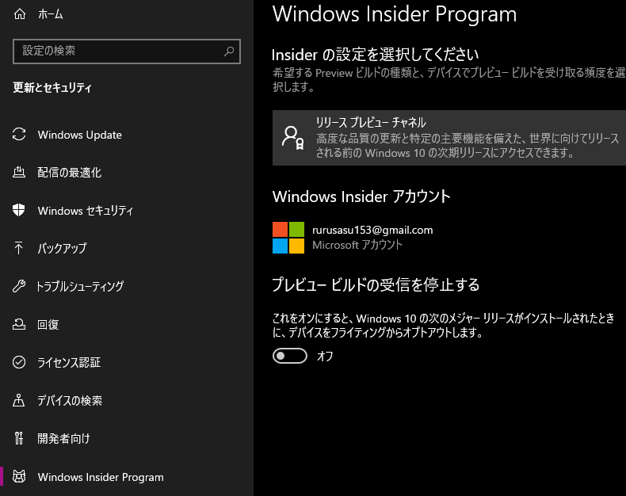
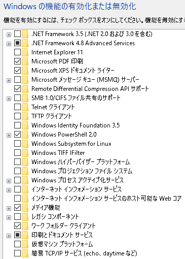
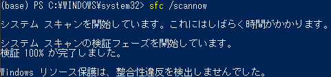

# PowerShell のアップデート

ちょっと脇道にそれて...

最近、PowerShell 上にこのような文章が表示されるようになった。


ちょっと気になっていたので、この機会にアップデートを行おうと思う。

1. まず、以下のコマンドで現在使用している `PowerShell` の version を確認する。

```PowerShell
$PSVersionTable
```

現在使用している `version` は `version 5.1` だった。


2. [PowerShell の GitHub](https://github.com/PowerShell/PowerShell) に行くことでインストーラをダウンロードできる。

今回は、`Windows(x64) - LTS .msi` をダウンロードした。


`.msi` をクリックすると以下のようにインストーラがダウンロードできる。


3. インストーラを開き、手順に従ってインストールする。


ダウンロードすると、今までの `Windows PowerShell` とは別に `PowerShell` という項目がスタート画面に追加される。


今まで使っていた `version 5.1` の `Windows PowerShell` は `Windows` 専用の `PowerShell` で現在開発は終了しているとのこと、。

新しくインストールされた `PowerShell` は `PowerShell Core` といい、これはクロスプラットフォーム対応で `Windows` だけでなく `Mac` や `Linux` にも対応しており、今後も継続して開発が行われていくらしい。

インストーラがあったなら、Chocolatey でもインストールできるんじゃないの？

って思ったら、案の定あった....


ということで、先ほどまでの手順でインストールした `PowerShell Core` はアンインストールし、 `Chocolatey` で新しくインストールする。

# PowerShell のスクリプトが実行できない場合の対処

先ほどのエラー画面で、以下のようなエラーが表示されていることが確認できる。

> このシステムではスクリプトの実行が無効になっているため、ファイル C:\Users\rurus\Documents\WindowsPowerShell\profile.ps1 を読み込むことができません。

[このページ](https://qiita.com/Targityen/items/3d2e0b5b0b7b04963750)によると、

> Windows の初期設定では PowerShell のスクリプトの実行が実行ポリシーによって許可されていないことが原因です。

以下のコマンドを実行することで、現在の `PowerShell` のスクリプトの実行ポリシーについて確認する。

```
PowerShell Get-ExecutionPolicy
```

初期設定では、`Restricted` の実行ポリシーになっているみたいだが、自分の設定もそのようになっていたことを確認。


この実行ポリシーを、恒久的に `RemoteSigned` に変更することでエラーが発生しなくなる。

```
PowerShell Set-ExecutionPolicy RemoteSigned
```


## 捕捉

実行ポリシーには以下の種類がある。


# WSL + docker + GPU (5)

そろそろ環境構築は終わらせたいぞ...

## WINDOWS Version の確認

コマンドプロンプトを管理者として実行し、以下のコマンドで、`Windows` の `version` を確認する。

```
ver
```


`Insider preview` の `Build 20150` 以降だと `WSL 2` が使用可能らしいが、確認してみると、現在の `Windows version` は `19041`...

`Insider preview` に参加するだけでは、最新の `Windows Build` をダウンロードできないのかもしれない。

以下のコマンドを、ファイルを指定して実行の部分に入力すると表示されるバージョンも確認する。

```
winver
```


やはりこちらも、`Build 19041`。

このことから、`WSL2` の実行には、`Windows version` ではなく、`Build version` を見なければいけない様子...

## Insider Preview の変更

これまで、Insider Preview は リリースプレビューチャネル に参加していた。



しかし、この チャネル では、`Build version 20150` 以降がインストールされなかったので、今回は、チャネルを ベータチャネル(推奨) に変更した。


これにより、新しく OS の version が更新された。


インストールして再起動した結果、


若干 `version` は上がったが、目標の `Build 20150` 以降には到達していない。

よって、`Insider Preview` を `Dev チャネル` に変更する。


早速、`Windows Update` を行う。


この時点で、新しい `Windows Build version` は `build 20150` 以降であることがわかる。

インストールして、再起動した後、確認するとしっかりと `build 20211` がインストールされていた。


## NVIDIA Drivers for CUDA on WSL のインストール

ホスト側の `windows` の準備ができたら、次に`Windows` 側に `NVIDIA Driver` をインストールする。

[`CUDA on Windows Sbusystem forf Linux (WSL) - Public Preview`](https://developer.nvidia.com/cuda/wsl)のページから `Get CUDA Driver` を辿って[ドライバのダウンロードページ](https://developer.nvidia.com/cuda/wsl/download)にアクセスし、`GeForce Driver` か `uadro Driver` のいずれかを自分の環境に合わせてダウンロードする。

今回は、`GeForce` を選択した。


`NVIDIA Developer Program Memberrship Required` と表示されたら `Login` する。


`Login` が終了すると `NVIDIA DEVELOPER` サイトに飛ばされるので、以下の部分を選択し、ダウンロードを継続する。


ダウンロードした `exe` ファイルを起動し、適当なフォルダにインストールする。


今回は、ドライバのみをインストールする。


## CUDA Toolkit のインストール

コンテナを使わずに直接 `CUDA` プログラムを実行する場合は、`WSL2` 上の `Linux` に `CUDA Toolkit` をインストールすればよい。

### CUDA Toolkit インストール時の注意

Linux 用の `NVIDIA Driver` をインストールしてはいけない。

[CUDA Toolkit の web サイト](https://developer.nvidia.com/cuda-toolkit) にアクセスし、自分が欲しいディストリビューションに合わせたダウンロードファイルを選択する。

今回は `Ubuntu` を使用するので、インストールするディストリビューションも `Ubuntu` を選択。また、`installer Type` は `deb (network)` を選択。


```
wget https://developer.download.nvidia.com/compute/cuda/repos/ubuntu2004/x86_64/cuda-ubuntu2004.pin

sudo mv cuda-ubuntu2004.pin /etc/apt/preferences.d/cuda-repository-pin-600

sudo apt-key adv --fetch-keys https://developer.download.nvidia.com/compute/cuda/repos/ubuntu2004/x86_64/7fa2af80.pub

sudo sh -c 'echo "deb https://developer.download.nvidia.com/compute/cuda/repos/ubuntu2004/x86_64/ /" > /etc/apt/sources.list.d/cuda.list'

sudo apt-get update

sudo apt-get -y install cuda
```

ここから、Ubuntu を起動使用としたが、いくつもエラーが発生したので、以下それの対応を示す。

# エラー修正

## リモート プロシージャ コール


> リモート プロシージャ コールに失敗しました。

[こちらのサイト](https://smart-change-phone.net/remote-procedure-call/)を参考に修正してみる。

### パソコンの再起動

### Windows ストアのトラブルシューティング

- 「設定 > 更新とセキュリティ」を開く。
- 「トラブルシューティング > 追加のトラブルシューティング」を選択。
- 「Windows ストアアプリ」を選択。
- 「トラブルシューティングツール」を実行。


### 関連サービスの設定値を確認

「リモートプロシージャコール」に関する **Windows サービスの設定値がおかしい** ためにエラーが発生している場合がある。

以下の手順で設定値を確認する。

- 「スタート上で右クリック > コンピュータの管理」

- 「サービスとアプリケーション > サービス」を選択。

- 以下のサービスの設定を全て「自動」に変更する。
  - DCOM Server Process Launcher
  - Remote Procedure Call (RPC)
  - Remote Procedure Call (RPC) Locator


`RPC Locator` が手動起動だった。これが影響している可能性がある。そこで、こちらを自動に変更する。


しかし、エラーは改善されなかった。

### Hiper-V などをアンインストールしてみる

- 「Windows の機能」 から以下のパッケージをアンインストール

  - Windows Subsystem for Linux
  - Windows ハイパーバイザープラットフォーム
  - 仮想マシン プラットフォーム



- 再起動し、再度インストールする


しかし、エラーは改善されない。

### システムスキャンを実施する

- 「Windows キー + x」を同時押しでメニューを開く。
- 「Windows PowerShell (管理者)」を選択する。
- 起動したウインドウで以下のコマンドを入力する。

  - `sfc /scannow`

- 「Enter」キーを押す。

結果は、`整合性違反は検出させませんでした`。



### KB4571756 との競合アンインストール

※ [こちらのサイト](https://www.nichepcgamer.com/archives/kb4571756-wsl2-errors.html)に同様の不具合が報告されていたので、こちらに従い、`KB4571756` をアンインストールする。

`KB4571756` は、[こちらのサイト](https://www.softantenna.com/wp/windows/windows-10-kb4571756-break-wsl2/)を参考にアンインストールする。

- 「設定 > 更新とセキュリティ」を開く。
- `Windows Update` で「更新履歴を表示する」を選択
- 「更新プログラムをアンインストールする」を選択
- 目的の更新プログラムを選択してアンインストールを実行
- 再起動する。

自分の場合、`KB4571756` という更新プログラムはインストーラされていないかったが、`KB4578846` が一番近いと感じたので、こちらをアンインストールしてみる。


アンインストールし、再起動したが、エラーとなった。


### PowerShell 実行ポリシーの再変更

`PowerShell` は


## PowerShell の文字化け

`Insider Preview` の `Dev` チャネルに参加してから、`Power Shell` が文字化けするようになった。


そこで、[こちらのサイト](https://qiita.com/s4i/items/75c19c9feb10b54c1ce9)を参考に、`Power Shell` の文字を `utf-8` に変更する。

- エクスプローラーで下記の場所を開く

```
%userprofile%\AppData\Roaming\Microsoft\Windows\Start Menu\Programs\Windows PowerShell
```

- 「`Alt` キー」を押しながら、`Windows PowerShell` をダブルクリックする > プロパティ画面が開く。

- 以下のようにリンク先を編集する。

```
%SystemRoot%\system32\WindowsPowerShell\v1.0\powershell.exe -NoExit -Command "chcp 65001"
```

文字化けしないかの確認のために、システムスキャンを実施する。

「PowerShell を管理者として実行」し、以下のコマンドを入力する。

```
sfc /scannow
```

起動時に文字化けはしなくなったが、コマンドを実行すると、再度文字化けする。


