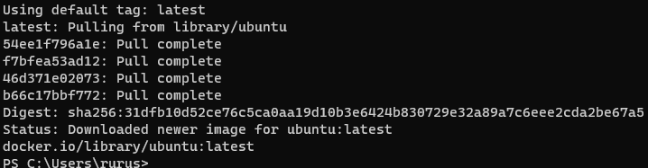
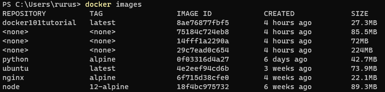
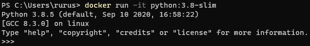

# WSL + Docker の開発環境

先日まで、WSL +Docker + GPU で開発環境構築を試みてみたが、`Windows Insider Preview` の `Dev チャネル` で新しくインストールされる `Build version` がうまく動作しなかったので、今回は、`Docker Desktop` を用いて構築を行う。

## `Chocolatey` で `Docker Desktop` をインストール

`Chocolatey` で、`Docker Desktop` をインストールする。


WSL2 を導入した状態で `Docker Desktop` をインストールすると、次の画面が表示される。


スタートを押すと、チュートリアルが開始される。


チュートリアルはスキップすることができる。

## `Docker for Desktop` の確認

次の設定が有効になっていることを確認する。


# Docker image を取得して動かす

今回は `Docker Hub` にある `Ubuntu` リポジトリからコンテナイメージを取得する。

```
docker pull ubuntu
```



再度、イメージを確認する。

```
docker images
```

めっちゃあるやん！！！！！

今日一の衝撃！！！



必要ないイメージをアンインストールする。

# Docker image のアンインストール

[`Dockerイメージとコンテナの削除方法`](https://qiita.com/tifa2chan/items/e9aa408244687a63a0ae) を参考に `Docker Container` をアンインストールする。

## 動いているコンテナの確認

```
docker ps
```


## 停止しているコンテナの確認

```
docker ps -a
```

Build されたイメージはなかったので、元のイメージの削除に移る。


## コンテナの削除

Build されたイメージがあった場合、次のコマンドを使用し、コンテナを削除する。

```
docker rm [コンテナ ID]
```


## イメージの削除

- まず次のコマンドで、インストールされているイメージを確認する。

```
docker images
```


- 次に以下のコマンドで、イメージを削除する。

```
docker rmi [イメージ ID]
```

実際にイメージの削除を行う。


- 最後に、イメージが削除されたかを確認する。


この手順を繰り返し、全てのイメージを削除する。


# 再度イメージをダウンロードし、セットアップする


取得したイメージから、コンテナを作成する。

```
docker run -it ubuntu
```

上記のコマンドを実行すると作成と同時にコンテナも起動し、そのタイミングで自動的にログインする。

ログイン状態を抜けるには `control` を押した状態で `P, Q` を順番に押す。この操作を「dettach (デタッチ)」という。

デタッチした後に再度
`docker ps`
コマンドで稼働状況を確認する。


STATUS が UP になっていることが確認できる。

先ほど dettach した ubuntu コンテナに再度ログインするには、以下のコマンドを実行する。

```
docker attach <CONTAINER ID または NAME>
```


コンテナを停止するには、コンテナ上で以下のコマンドを使用する。

```
exit
```

稼働中のコンテナ一覧に表示されなくなった。


# bash の有無

Docker image を run するときに bash を付けるか付けないかによって、コマンドウインドウが変化したので、記録する。

## bash 有り

`docker run` コマンドの最後に `bush` を付けると、linux ターミナルが起動する。


## bash 無し

`docker run` コマンドの最後に `bush` を付けないと、`python` が起動する。



## 理由

これは、`bash` を付けなかった場合、 [python:3.8-slim の docker image](https://github.com/docker-library/python/blob/9ff5f04241c7bcb224303ff8cea9434e9976f8af/3.8/buster/slim/Dockerfile) の最後にある `CMD ["python3"]` が起動するためである。

# Docker で GPU を使うには....

やはり、`nvidia docker` を使うのが一番らしい...

そこで、[nvidia の Docker Hub](https://hub.docker.com/r/nvidia/cuda) より、以下のコマンドで、イメージをダウンロードする。

```
docker pull nvidia/cuda:11.0-base-ubuntu20.04
```

そして、次のコマンドでイメージを `build` する。

```
docker run -it nvidia/cuda:11.0-base-ubuntu20.04
```


# 方針転換

[このページ](https://qiita.com/hoto17296/items/be34849412e7ae9db6ff) によると、

次の環境変数をセットしておけば、`TensorFlow GPU` を使用できるらしい。

よって、こちらの導入方法に移行する。

```Dockerfile
FROM continuumio/miniconda3

RUN conda install -y tensorflow-gpu


ENV NVIDIA_VISIBLE_DEVICES all
ENV NVIDIA_DRIVER_CAPABILITIES utility,compute
```

## Dockerfile の build

Dockerfile を保存しているフォルダに移動し、以下の部分に `cmd` と入力しコマンドプロンプトを立ち上げる。


そして、以下のコマンドで `Dockerfile` を `build` する。

```
docker build . -t deeplearning
```


最後に、以下のコマンドでコンテナを立ち上げる。

```
docker run -it deeplearning
```


しかし、[現状 WSL2 では GPU が使用できない](https://ja.stackoverflow.com/questions/68415/windows10%E3%81%A7docker%E3%82%92%E4%BD%BF%E3%81%A3%E3%81%A6gpu%E3%82%92%E4%BD%BF%E3%81%A3%E3%81%9Fdeeplearning%E7%92%B0%E5%A2%83%E3%82%92%E6%A7%8B%E7%AF%89%E3%81%97%E3%81%9F%E3%81%84) ので、今回はここで断念することに...。
