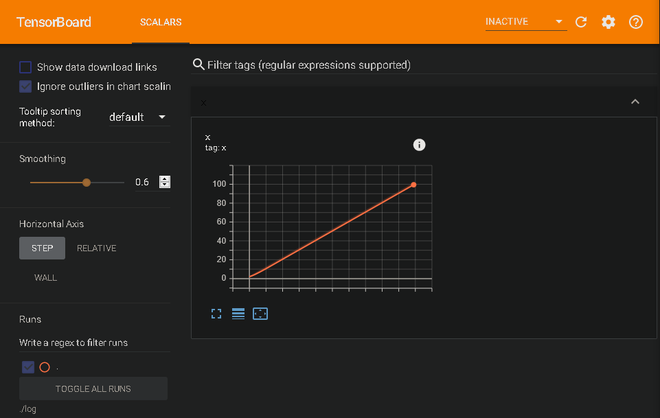

# Jupyter での VGG16 の実装

参考 : [TensorFlow 2.X の使い方を VGG16/ResNet50 の実装と共に解説](https://qiita.com/anieca/items/9dfe3ef46e7b655bf3ee)

# Tensorflow エラー対処

まず、次のようなエラーが発生した。


このエラーに対処するために、まず `tf.summary` について調べた。

# Tf.Summary

`tf.summary()` とは、`TensorBoard` を扱うモジュール。

`tf.summary` を用いることで様々なものを可視化することができる(ただし、Web 上の TensorBoard と接続する必要がある)。

参考:[あらゆるデータを可視化する TensorBoard 徹底入門](https://deepage.net/tensorflow/2017/04/25/tensorboard.html)

## Basic Cord

参考:[Graph と Eager で動作する summary の出力方法](https://qiita.com/jack_ama/items/491e073cadfdd738bf6c)

まず、基本的なコードを以下に示す。

```python
import tensorflow as tf

import sys
import os

sys.path.append(".")

logdir_name = "log"

logdir = os.path.dirname(os.path.abspath(__file__))
logdir = logdir + os.sep + logdir_name
print(logdir)

writer = tf.summary.create_file_writer(logdir=logdir)
writer.set_as_default()

x = tf.Variable(1, name="x")

for i in range(100):
    x.assign_add(1)
    tf.summary.scalar("x", x, step=i, description="first valiable")
```

このコードを実行すると、コードがあるディレクトリ内に自動的に `log` ディレクトリが生成される。そして、その中にプログラムの `log` データが保存される。

プログラムを実行したら、そのディレクトリにコマンドプロンプトから接続し、以下のコマンドを実行して、`tensorboard` を起動する。

```コマンドプロンプト
tensorboard --logdir=./log
```

すると、URL が表示されるので、「Alt を押しながら」URL をクリックして、`Tensorboard` に接続する。


接続に成功すると、次のグラフが表示される。


今日はここまで。
