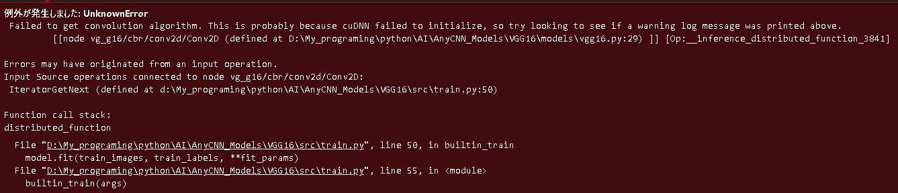

# Tnsorflow + cuda

昨日作成したプログラムを実行すると、次のエラーが出た。



エラー内容は、

> 畳み込みアルゴリズムの取得に失敗しました。これは cuDNN の初期化に失敗したためと思われますので、上記の警告ログメッセージが出力されていないか探してみてください。

# jupyter の影響

[調べて最初にヒットしたページ](https://qiita.com/Ka-k/items/cb942855ab669ff60630) では、 `jupyter` の影響が報告されていた。

そのサイトが参考にしていたページに、次の文を見つけた。

[jypyter notebook の基本的な使い方](https://code-graffiti.com/how-to-use-jupyter-notebook/#toc17)

> 作業していたブラウザのタブを閉じるだけでは終了したことにはなりません。

## Tensorflow の仕様

先ほどのサイトより引用

> Tensorflow-gpu は、デフォルトだと **GPU の空いている領域を全て確保しようとする。**
>
> そして、Jupyter をタブ閉じで終わらせると、**GPU を確保したままゾンビ化する。**

ということで、パソコンを再起動し再度動作させてみたが、同様のエラーが発生した......

## 使用する GPU の設定

このページとこのページを参考に、使用する `GPU` を設定できるようにした。

設定を下記に示す。

```python
def gpu_setup(gpu_num=0):
    """使用する GPU を設定する
    Args:
        gpu_num(int):
    """
    physical_devices = tf.config.list_physical_devices("GPU")

    if physical_devices:
        try:
            print("# Found {} GPU(s)".format(len(physical_devices)))

            for device in physical_devices:
                tf.config.set_visible_devices(physical_devices[gpu_num], "GPU")
                tf.config.experimental.set_memory_growth(
                    physical_devices[gpu_num], True
                )
                print(
                    "# {} memory growth: {}".format(
                        device, tf.config.experimental.get_memory_growth(device)
                    )
                )

        except RuntimeError as e:
            print(e)

    else:
        print("Not enough GPU hardware devices available")
```

このプログラムを追加し、再度学習を実行すると、プログラムが正常に動作した。

# 論文

## 言語獲得におけるシンボルグラウディング

シンボルグラウディングの例

- 子供がいかにレキシコン(心的語彙・概念辞書)を獲得するかということ
- 子供がレキシコンを構築するには、以下の手順をを踏んでいると考えられる。
  1. 感覚情報(主に視覚、時として触覚情報)から環境中に存在する様々な対象を切り出す。
  2. その対象に対してシンボル(表象：心象、イメージ)を作り出す。
  3. そのシンボルにラベルを対応付ける。

シンボルは、抽象化され、汎用性を伴ったものでないとラベル付けできない。

例えば、対象が個別性を「もつ」のか「もたない」のか。

- コップは個別性を「もつ」

  - 全体形状および機能性が「コップ」のカテゴリ成員を決定する。
  - 色・素材・部分などは「コップ」の本質とは何ら関係がない。
  - 壊れたコップの「かけら」や「一片」はコップではない。

- 粘土は個別性を「もたない」
  - 形状は無関係 (様々な形状に成形可能)
  - ちぎる前も、ちぎったかけらも粘土

目の前の対象がどちらのカテゴリに属するのかを判断できないと、その対象へのラベル付けは**不可能**。

個別性について判断されると、その対象のほぼ無制限に存在する可能な属性の中から、カテゴリにとって関連性のある属性を抽出しなければならない。

例えば、「ネコ」

- 全体的な形態は重要だが、色はバリエーションを許す。
- 先端部分(しっぽ)の長さ、形状はバリエーションを許す。
- 全体の大きさ、胴体の太さもある一定範囲内でバリエーションを許す (トラほど大きいネコは存在しない)

など、「**属性抽出**」が行われなければ、「ネコ」というカテゴリを形成することは不可能。

「ロシアンブルー」などネコの下位カテゴリの成員を決定する場合には、毛の長さや色がとても重要になる (**カテゴリは階層構造を持つ**)。

### ガヴァガーイ問題

人間が語意を学習することは、大きなパラドックスを含む問題である。

人間の子供の語意の学習は何らかの形で制約されているので、ガヴァガーイ問題に直面しない、つまりそもそも論理的には生成可能な無限数の意味の中から一つ一つの可能性を取り上げ、吟味するようなことはしない。

## 知識の獲得と学習

1980 年代、人工知能の分野で開発された多くの学習システムは、学習結果に相当するプログラムを人が直接コンピュータに与えることができ、その方が性能上は良いシステムになるという性質のものであった。

* これらのシステムは人の行っている情報獲得メカニズムを分析して機械に再現させることを目的とする。
* 人間でも困難な発見的学習はほとんど実現していない。

