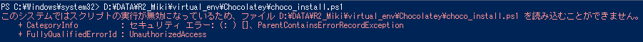
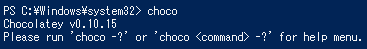

<!--
theme: default
size: 4:3
page_number: true
paginate: true
header: "2020年9月25日"
style: |

  section { font-size: 20px;}

  header {
    width: 100%;
    font-size: 20px;
    color: black;
    padding: 1px;
    top: 50px;
  }

  footer {
    width: 100%;
    font-size: 20px;
    color: black;
    text-align: right;
    padding: 15px;
  }

  h1 {
    font-size: 40;
    color: navy;
  }

  h2 {
    font-size: 35;
    color: navy;
  }

  h3 {
    font-size: 30;
    color: navy;
  }

  pre, code{
    font-size: 18px;
  }
-->

# Chocolatey の自動インストール

パソコンが新しくなったので、Powershell から Chocolatey をワンクリックでインストールし、環境構築を自動的に行えるようプログラムを組む。

## PowerShell のセキュリティを下げる

PowerShell のセキュリティが `Restricted` の場合、PowerShellIDE を管理者として実行しても、スクリプトを実行することができない。



そのため、以下のサイトを参考に PowerShell のセキュリティを下げてデバッグを行う。

[PowerShell のスクリプトが実行できない場合の対処方法](https://qiita.com/Targityen/items/3d2e0b5b0b7b04963750)

---

現在のセキュリティは以下のコマンドで確認することができる。

```
PowerShell Get-ExecutionPolicy
```

その結果、現在はセキュリティレベルにおいて最高の `Restricted` が適用されていることが分かった。

そこで、このセキュリティレベルを `RemoteSigned` まで低下される。
以下のコマンドを管理者権限で実行した PowerShell に打つことで恒久的にセキュリティを下げることができる。

```
PowerShell Set-ExecutionPolicy RemoteSigned
```

---

## 管理者として Powershell を実行

chocolatey をインストールするには、powershell を管理者として実行する必要がある。
今回は 2 つのスクリプトファイルを用意し、一方で PowerShell を管理者として立ち上げ、もう一方のファイルを管理者として実行した PowerShell 上で処理する。

PowerShell を管理者として実行するスクリプトファイルは下記のサイトを参考にした。

- [【Start-Process】PowerShell から管理者として実行させるテクニック](https://cheshire-wara.com/powershell/ps-cmdlets/system-service/start-process-runas/)
- [.ps1 ファイルを管理者権限で実行する](http://sloppy-content.blog.jp/archives/14246695.html)

```start-process.ps1
# 管理者権限で実行したいファイルのパス
$file = (Convert-Path .\choco_install.ps1)
Write-Output $file

# PowerShellを管理者権限で実行
Start-Process -FilePath powershell -ArgumentList $file -Verb runas

# スクリプト実行後、自動的にPowerShellが閉じないようにする
pause
```

---

## chocolatey のアンインストール

スクリプトファイルを実行して Chocolatey をインストールすることができたが、デバッグを行いたかったので、chocolatey を一度アンインストールする。

Chocolatey は `C:\ProgramData\chocolatey` に保存されているため、このディレクトリを削除することでアンインストールすることができる。

そこで、以下のスクリプトファイルを作成し、Chocolatey をアンインストールした。

```Chocolateyアンインストール
Remove-Item C:\ProgramData\chocolatey
```

---

## エラー処理

Chocolatey はインストールに成功すると、次のコマンドが実行可能になる。

```
$ choco
```



そこで、このコマンドが使用できる状態をインストール成功、使用できない状態をインストール失敗もしくはインストールされていないと過程し、条件分岐にてインストールを行うかを決めるようにする。

そのため、次のサイトを参考に `try-catch` 文にて条件分岐を作成した。

[PowerShell 使い方メモ](https://qiita.com/opengl-8080/items/bb0f5e4f1c7ce045cc57)

---

```PowerShell choco_install.ps1
# この値を 'stop' にすることで、エラーの発生とともに処理が中断される。
$ErrorActionPreference = "stop"

Write-Output "セキュリティを一時的に緩めます。"
# セキュリティ設定を一時的に緩める
Set-ExecutionPolicy AllSigned

# もし、Chocolateyがインストールされていない場合
try {
    $ result = choco
    echo $result
}
catch {
    Write-Output "Chocolateyをインストールします。"
    # Chocolateyをインストールする
    Set-ExecutionPolicy Bypass -Scope Process -Force; [System.Net.ServicePointManager]::SecurityProtocol = [System.Net.ServicePointManager]::SecurityProtocol -bor 3072; iex ((New-Object System.Net.WebClient).DownloadString('https://chocolatey.org/install.ps1'))
}

try {
    $ result = choco
    echo $result
}
catch {
    Write-Output "Chocolateyのインストールに失敗しました。"
    echo $Error[0]
}

Write-Output "セキュリティ設定をもとに戻します。"
# セキュリティ設定を元に戻す
Set-ExecutionPolicy RemoteSigned

# スクリプト実行後、自動的にPowerShellが閉じないようにする
pause

```

---

# パッケージのインストール

XML 形式で保存されたパッケージ情報をもとに、自動的にすべてのパッケージをインストールするスクリプトファイルを作成。

その際、下記のサイトを参考にした。

[chocolatey 基本情報まとめ](https://qiita.com/NaoyaOura/items/1081884068fe3ea79570)

```PowerSHell package_install.ps1
# この値を 'stop' にすることで、エラーの発生とともに処理が中断される。
$ErrorActionPreference = "stop"

# .configファイルの内、更新日が最新のものを変数に格納
$ChildItems = (Get-ChildItem . -Recurse *.config | Sort-Object LastWriteTime -Descending)[0].FullName

try {
    choco install -y $ChildItems
}
catch {
    Write-Output "パッケージのインストールに失敗しました。"
    echo $Error[0]
}
```

しかし、管理者として 2 回 Powershell を実行することはできなかったため、別方法を検討中。
