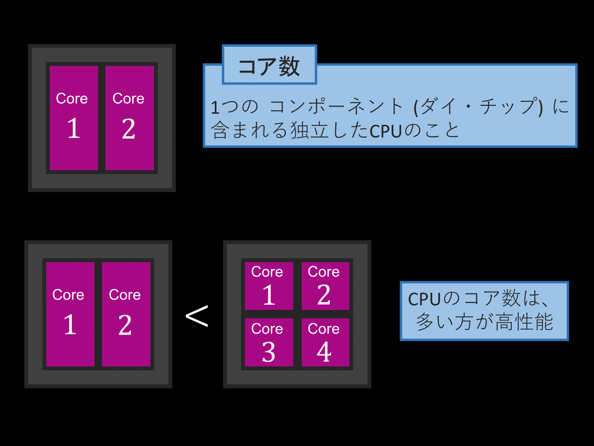
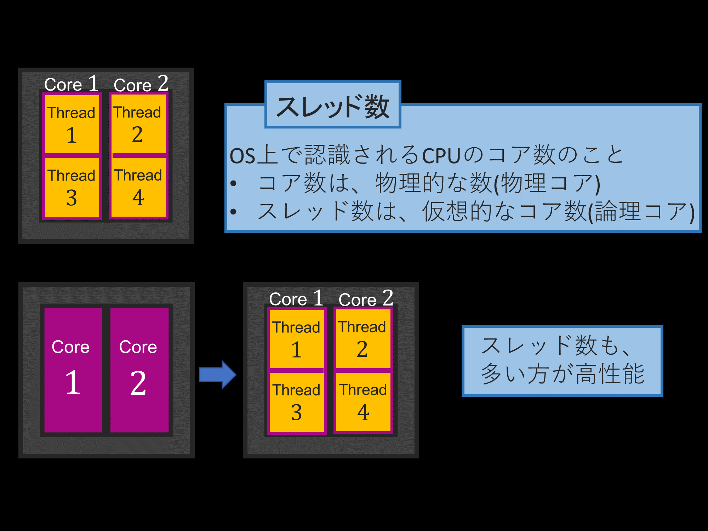
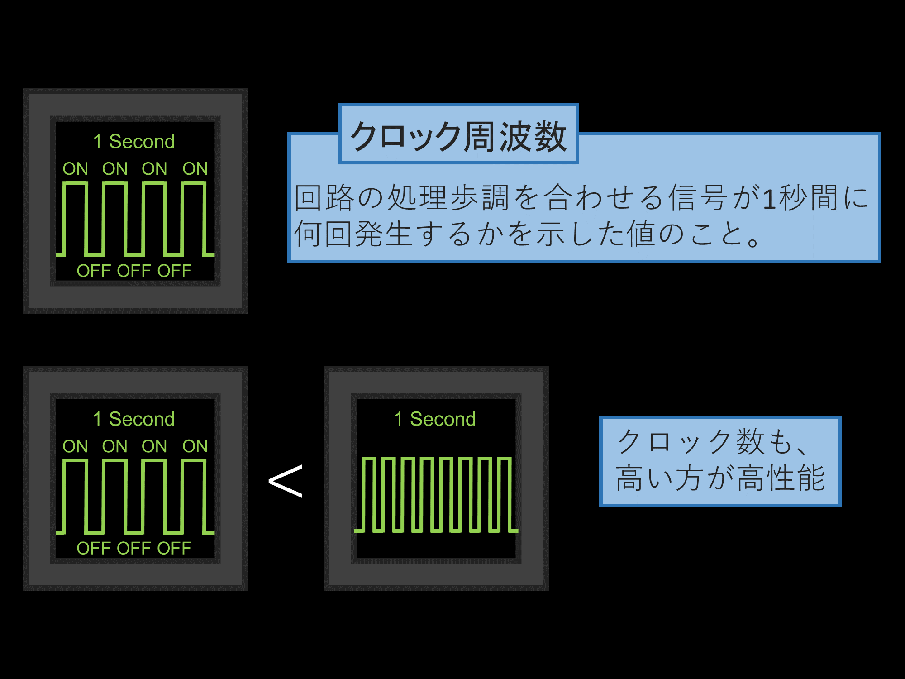
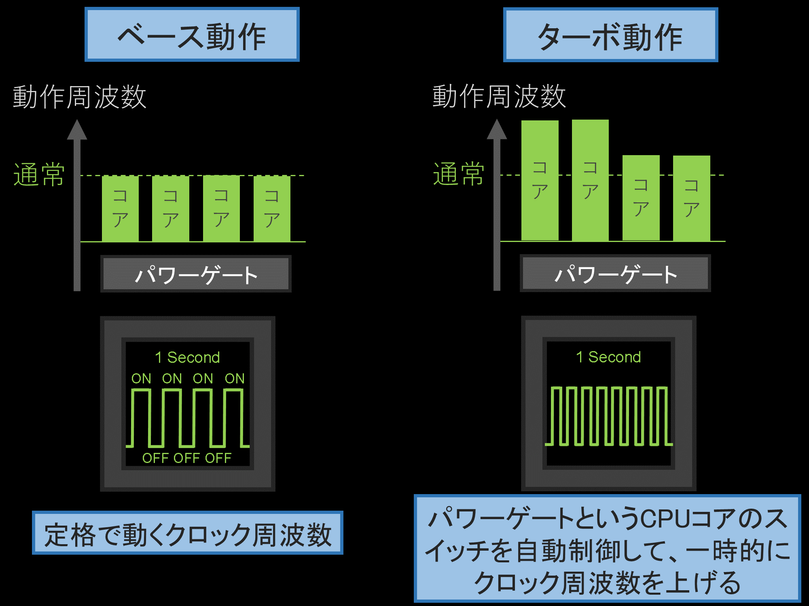
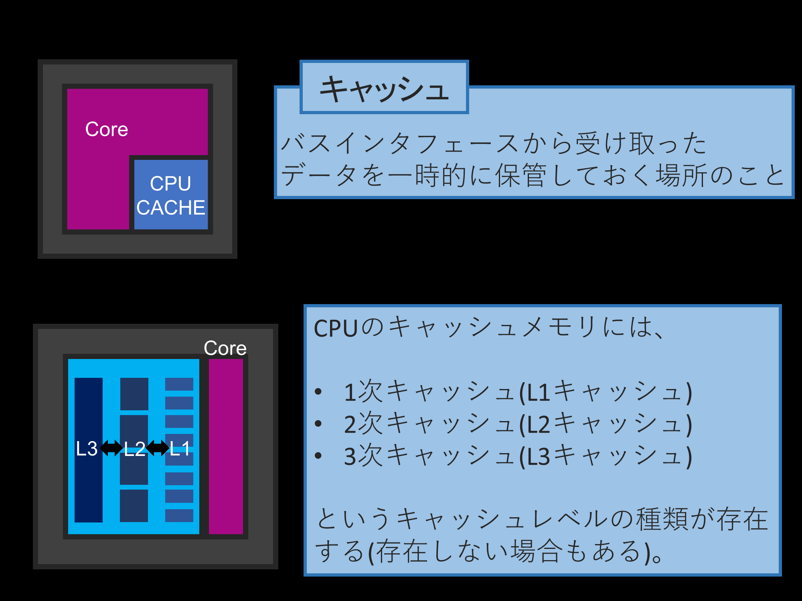
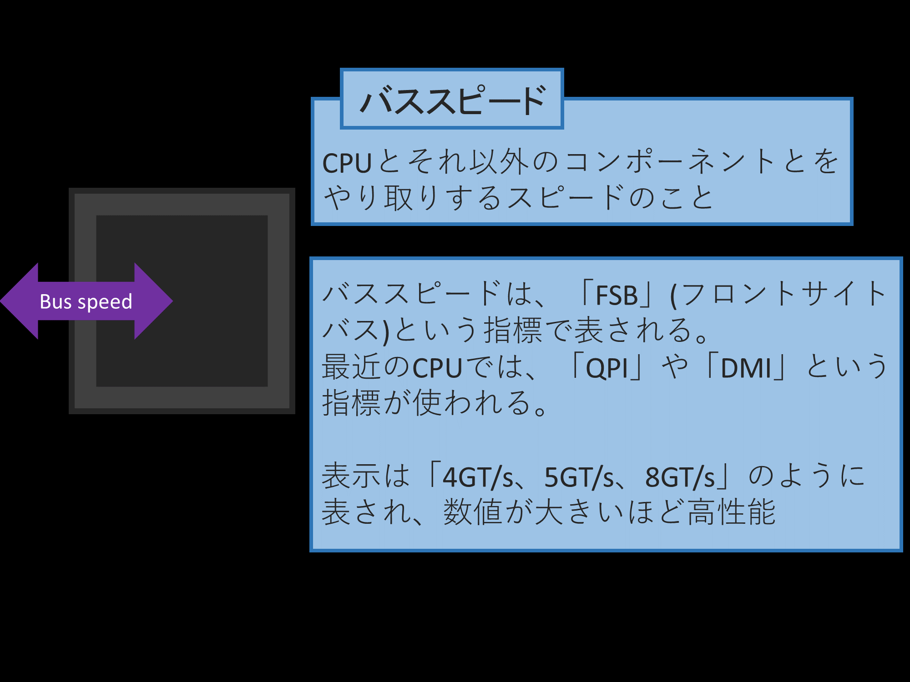

# CPU の性能比較

以下のサイトがわかりやすかった。
[CPU 性能（スペック）を決める“5 大要素”とその指標の見方](https://8vivid.net/cpu-5-specs/)

## CPU の性能を決める要素

- コア数
- スレッド数
- クロック周波数
- キャッシュ
- バススピード

## コア数

## スレッド数

## クロック周波数

## キャッシュ

## バススピード

