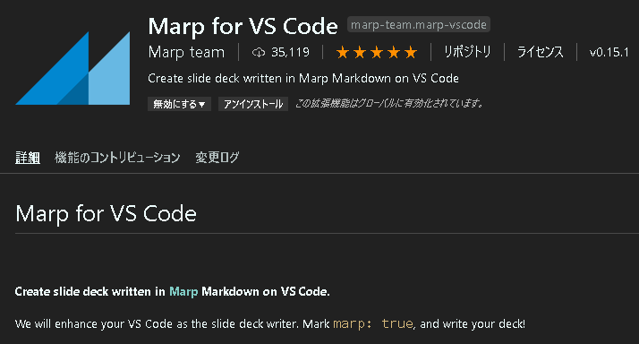
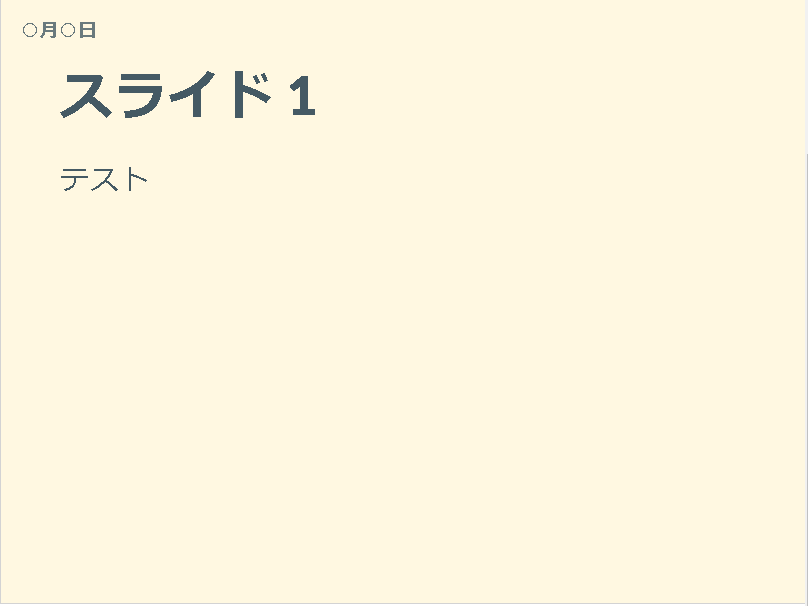

# Markdown で日誌を書く

少し前から、Markdown で日誌を付けてきたが一度印刷してみると、ページ区切りがバラバラでとても読みにくかった。

そこで、これを機に日誌をスライド形式に変更し、自分でも読み返し易くしようと思う。

その際、以下のサイトを参考にした。

- [[ Markdown でスライド作成 ] 5 種類くらいツールを試してみた結果](https://qiita.com/ykhirao/items/74a23f812dd5d22b3b88)
- [【VS Code + Marp】Markdown から爆速・自由自在なデザインで、プレゼンスライドを作る](https://qiita.com/tomo_makes/items/aafae4021986553ae1d8)
- [Marp を使って markdown でスライド資料を作成する](https://dev.classmethod.jp/articles/make-slides-from-markdown-with-marp/)

## Marp のインストール

VSCode の拡張機能から、「Marp for VSCode」をインストールする。



## Marp 有効化

---

次のコマンドを .md ファイルの始めに付けることで、Marp を有効化できる。

```Markdown
---
marp: true
---
```

## テーマの切り替え

Marp では、`( theme: default )` と `( theme: gaia )` の 2 種類が選択できる。

Gaia テーマには、さらに 3 つのテンプレートが存在する。

- template: default
- template: invert
- template: gaia

また、テーマはスライド毎に指定することはできず、スライド全体に適用される。しかし、テンプレートはスライド毎に適用可能。

## スライドのアスペクト比・サイズの指定

スライドのアスペクト比およびサイズは以下から選んで指定することができる。

```
4:3, 16:9, A0-A8, B0-B8 and suffix of -portrait
```

実際に変更するには CSS を用いて以下のように記述する。

```CSS
<!-- size: 16:9 -->
```

## フォントサイズの変更



デフォルトのフォントサイズでスライドを作成すると、フォントサイズが大き過ぎるため、あまりたくさんの文章を 1 つのスライドに入れることができない。

そこで、フォントサイズおよび、フォントの変更を行う。

その際は、以下のサイトを参考にした。

- [Marp for VS Code の使い方](https://snowsaber.dip.jp/page/etc/marp.html)
- [markdown 記法で、フォントサイズを極小にする方法ってありますか？](http://w3q.jp/t/8513)
- [Marp を使ってスライドを作ってみる](https://blog.okazuki.jp/entry/2019/07/24/182744)

これらサイトから、スライドのタイトルは以下の方法でフォントサイズを変更できることが分かった。

```Markdown
h1 {font-size: 40px;}
h2 {font-size: 30px;}
h3 {font-size: 20px;}
pre, code{font-size: 18px;}
```

ここで、

- `# → h1`
- `## → h2`
- `### → h3`

のことを表す。

また、コードの場合は、`pre, code` のフォントサイズを変更することでフォントサイズが変わるらしい。

## ページ番号指定

`paginate: true` を `marp: true` の下に挿入することで、スライドの右下にページ番号を表示できるようになる。

```Markdown
---
marp: true
paginate: true
---
```

## テンプレートを設計

```Markdown
---
marp: true
theme: gaia
paginate: true
header: "**○月○日**"
---

<!--
size: 4:3
page_number: true
-->

<style>
h1 {font-size: 40px;}
h2 {font-size: 30px;}
h3 {font-size: 20px;}
pre, code{font-size: 18px;}
</style>

# タイトル

---

# スライド 1

テスト

---

# スライド 2

テスト

```

# template を書く

ここまで、フォントサイズなどを調整してきたが、一番変更したい文章のフォントサイズを設定する方法がわからなかった。
そこで、`template CSS` に本文のフォントサイズの設定を含め、これまでの全ての設定を包括した設定を記述して、より日誌作成を楽に行えるよう試みる。

しかし、この方法は成功しなかった。だが、`style` コマンドと CSS を使用することで、`template.md` を直接的に作成した。

その際、以下のサイトを参考にした。

- [Marp で会社のスライドテンプレを作ってみる](https://future-architect.github.io/articles/20200812/)
- [Markdown でスライドを作成する（Marp for VS Code）](https://www.nekohita.tokyo/2020/03/13/tips/marp-for-vscode/)

最終的に以下のようなテンプレートが完成した。

```Markdown
---
marp: true
---

<!--
theme: default
size: 4:3
page_number: true
paginate: true
header: "2020年○月○日"
style: |

  section { font-size: 20px;}

  header {
    width: 100%;
    font-size: 20px;
    color: black;
    padding: 1px;
    top: 50px;
  }

  footer {
    width: 100%;
    font-size: 20px;
    color: black;
    text-align: right;
    padding: 15px;
  }

  h1 {
    font-size: 40;
    color: navy;
  }

  h2 {
    font-size: 35;
    color: navy;
  }

  h3 {
    font-size: 30;
    color: navy;
  }

  pre, code{
    font-size: 18px;
  }
-->

# タイトル

---

# スライド 1

テスト

---

# スライド 2

テスト


```
