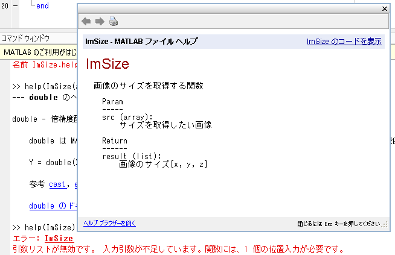

# Matlab 関数を別ファイルに移動する

python をやっていて関数を別のファイルで定義し、必要な時に呼び出すということを学んだ。

このテクニックを Matlab でも生かせないかと思い、挑戦してみる。

以下のページを参考にした。

[関数のファイルでの作成](https://jp.mathworks.com/help/matlab/matlab_prog/create-functions-in-files.html)

## 別ファイルで関数を作成

> 注意点！
>
> Matlab では、関数とファイル名を同じにする。
>
> なぜなら、Matlab がプログラムをファイル名に関連づけるから。

試しに、画像を入力としてそのサイズを返す関数を作成する。

```Matlab ImSize
function result = ImSize(src)

    [y,x,z] = size(src);
    result = [x, y, z];

end
```

この関数に、uint8 の配列を渡すと、次のような出力を得ることができる。

```Matlab
a = ones(3, 3, 3, 'uint8')

result = ImSize(a)

result =
    3, 3, 3
```

# デフォルト引数の設定

python では、次のようにして関数の引数に初期値を設定しておくことができる。

```python
def test_plot(net, plot_data, LogPlot=(False, False)):
```

このようにすることで、入力が渡されない引数が存在する場合でもデフォルト引数を用いて処理を続行させることができる。

しかし、Matlab ではデフォルト引数を上記のように設定することができなかったので、設定する方法が別にないか、調べてみた。

その際、参考になったサイトを下記に示す。

- [MATLAB】入力引数のデフォルト値設定と検証方法: Arguments を使う場合](https://qiita.com/eigs/items/5d4f93464eb6506bead6)

* [関数の引数の検証](https://jp.mathworks.com/help/matlab/matlab_prog/function-argument-validation-1.html)

* [引数の検証関数](https://jp.mathworks.com/help/matlab/matlab_prog/argument-validation-functions.html)

試しに、先ほどの関数を次のように変更してみる。

```Matlab
function result = ImSize(src)

    arguments
        src {mustBeNonempty, mustBeNumeric, mustBePositive}
    end

    [y,x,z] = size(src);
    result = [x, y, z];
end
```

このように設定することで、入力が条件 ({}で与えられる) を満たさない場合は、エラーを発生させ処理を中断することができる。

今回は、画像を入力として渡すことを想定しているため、次のような条件を設定した。

- mustBeNonempty : value が空であればエラー
- mustBeNumeric : value が数値でなければエラー
- mustBePositive : value > 0 値が正でないならばエラー

実際に条件を与えることで、入力引数がそれを満たさない場合にエラーが発生するかを調べてみた。

そのために、条件を次のように変更した。

- mustBeNonempty : value が空であればエラー
- mustBeNumeric : value が数値でなければエラー
- **mustBeNonpositive : value > 0 値が負でないならばエラー**

```Matlab
a = ones(3, 3, 3, 'uint8')

result = ImSize(a)

エラー: ImSize
位置 1 の引数が無効です。 値を正にしてはなりません。
```

このように、条件を見たしてない引数が存在する場合、その引数の位置と引っ掛かった条件を表示してくれる。

# プログラムへのヘルプの追加

python では、以下のように定義された関数名の下に文章を加えることで、その関数の使用方法や引数および返り値の型を使用者に知らせることができる。

```python
def fit(self, X, y):
        """トレーニングデータに適合させる

        Params
        ------
        X (配列のようなデータ構造) shape = [n_samples, n_features]:
            トレーニングデータ
            n_sampleはサンプルの個数、n_featuresは特徴量の個数

        y (配列のようなデータ構造) shape = [n_samples]:
            目的変数

        Return
        ------
        self (Object):
        """
```

このように関数の説明をする文章の表記方法はプログラミング言語によって違うため、Matlab でも同様のことができないかを調べてみた。

その際、参考にしたサイトを以下に示す。

[プログラムへのヘルプの追加](https://jp.mathworks.com/help/matlab/matlab_prog/add-help-for-your-program.html)

Matlab では、

> プログラムの最初にコメントを挿入してヘルプテキストを作成します。
> プログラムに関数が含まれている場合、ヘルプテキストは関数の定義行(function キーワードのある行) のすぐ下に配置します。

試しに、ImSize 関数に説明文を追加してみる。

```Matlab
function result = ImSize(src)
% 画像のサイズを取得する関数
%
%   Param
%   -----
%   src (array):
%       サイズを取得したい画像
%
%   Return
%   ------
%   result (list):
%       画像のサイズ[x, y, z]

    arguments
        src {mustBeNonempty, mustBeNumeric, mustBePositive}
    end

    [y,x,z] = size(src);
    result = [x, y, z];
end
```

ヘルプテキストを追加することで、関数の実行時にエラーが発生した場合などにその関数についてのヘルプを参照することができるようになる。


