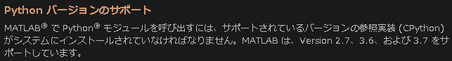
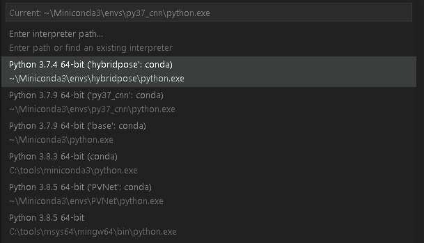

# Virtualbox + Vagrant + Docker で環境構築

Matlab と python をブリッジして使いたいと思ったので、今回はそのための環境構築を行う。

以下のサイトを参考に環境構築を行う

[VirtualBox + Vagrant + Docker による OS に縛られないコンテナ環境セットアップ](https://qiita.com/GCkurabe/items/151c2a57688c03cfbdd8)

## Vagrant による Docker 用仮想マシンの作成

まず、`Docker` 用の `Vagrantfile` を作成する。

`Vagrantfile` を 作成したいディレクトリに移動し、以下のコマンドを実行する。

```ComandPrompt
$ vagrant init
```

すると以下のようなファイルが生成される。

```Vagrant
# -*- mode: ruby -*-
# vi: set ft=ruby :

# All Vagrant configuration is done below. The "2" in Vagrant.configure
# configures the configuration version (we support older styles for
# backwards compatibility). Please don't change it unless you know what
# you're doing.
Vagrant.configure("2") do |config|
  # The most common configuration options are documented and commented below.
  # For a complete reference, please see the online documentation at
  # https://docs.vagrantup.com.

  # Every Vagrant development environment requires a box. You can search for
  # boxes at https://vagrantcloud.com/search.
  config.vm.box = "base"

  # Disable automatic box update checking. If you disable this, then
  # boxes will only be checked for updates when the user runs
  # `vagrant box outdated`. This is not recommended.
  # config.vm.box_check_update = false

  # Create a forwarded port mapping which allows access to a specific port
  # within the machine from a port on the host machine. In the example below,
  # accessing "localhost:8080" will access port 80 on the guest machine.
  # NOTE: This will enable public access to the opened port
  # config.vm.network "forwarded_port", guest: 80, host: 8080

  # Create a forwarded port mapping which allows access to a specific port
  # within the machine from a port on the host machine and only allow access
  # via 127.0.0.1 to disable public access
  # config.vm.network "forwarded_port", guest: 80, host: 8080, host_ip: "127.0.0.1"

  # Create a private network, which allows host-only access to the machine
  # using a specific IP.
  # config.vm.network "private_network", ip: "192.168.33.10"

  # Create a public network, which generally matched to bridged network.
  # Bridged networks make the machine appear as another physical device on
  # your network.
  # config.vm.network "public_network"

  # Share an additional folder to the guest VM. The first argument is
  # the path on the host to the actual folder. The second argument is
  # the path on the guest to mount the folder. And the optional third
  # argument is a set of non-required options.
  # config.vm.synced_folder "../data", "/vagrant_data"

  # Provider-specific configuration so you can fine-tune various
  # backing providers for Vagrant. These expose provider-specific options.
  # Example for VirtualBox:
  #
  # config.vm.provider "virtualbox" do |vb|
  #   # Display the VirtualBox GUI when booting the machine
  #   vb.gui = true
  #
  #   # Customize the amount of memory on the VM:
  #   vb.memory = "1024"
  # end
  #
  # View the documentation for the provider you are using for more
  # information on available options.

  # Enable provisioning with a shell script. Additional provisioners such as
  # Ansible, Chef, Docker, Puppet and Salt are also available. Please see the
  # documentation for more information about their specific syntax and use.
  # config.vm.provision "shell", inline: <<-SHELL
  #   apt-get update
  #   apt-get install -y apache2
  # SHELL
end

```

次に、 `config.vm.box = "base"` に Virtual Box にロードする `box` ファイルを指定しなければならない。今回は Neural Network を VirtualBox 上で学習させるつもりなので、`GPU` が読み込まれかつ動作することが最低条件となる。そのため、その条件に合う `box` ファイルが公開されていないか、[Vagrant Cloud](https://app.vagrantup.com/boxes/search) で検索してみた。しかし、NVIDIA のイメージは検索に引っ掛からず....


そこで、`NVIDIA-Cuda` が使用できる `Box ファイル` から作成することに。

# NVIDIA-Cuda が使用可能な Box ファイルの作成

下記のサイトを参考に作業を行う

- [Vagrant でオリジナル Box を作成する](https://qiita.com/sims0728/items/306cf0434046296459b5)

## OS イメージのダウンロード

と思ったら....


OS をダウンロードしようとして行った検索結果に不穏な文字が...

結局、調べたところ 以前の WSL2 同様 VirtualBox でも CUDA を動作させる方法は存在しなさそうだった。

そのため、Windows が Update されるまでは保留に...

# Miniconda を使った環境構築

Matlab から Python を呼び出すには、現状、Python 3.7 までしか対応していないらしい。

[システム要件と構成要件](https://jp.mathworks.com/help/matlab/matlab_external/system-and-configuration-requirements.html)



そこで、以降 Python にアップデートがあった場合でも、ブリッジに影響がないように、Miniconda を使用して Python 用の仮想環境を構築しておく。

## Matlab が Python を読み込むか確認

Matlab が `python=3.7` を読み込むことができるかを確認する。

そのために、MAtlab に以下のコマンドを打ち込む

```Matlab
>> pyenv()

ans =

  PythonEnvironment のプロパティ:

          Version: "3.7"
       Executable: "C:\Users\rurus\Miniconda3\python.EXE"
          Library: "C:\Users\rurus\Miniconda3\python37.dll"
             Home: "C:\Users\rurus\Miniconda3"
           Status: NotLoaded
    ExecutionMode: InProcess
```

この結果から、しっかりと `python = 3.7` が読み込まれていることがわかる。

## 仮想環境構築

python=3.7 が読み込まれていることが確認できたので、この `Virsion` をベースに環境構築を行う。

その際、以下のサイトを参考にした。

- [【初心者向け】Anaconda で仮想環境を作ってみる](https://qiita.com/ozaki_physics/items/985188feb92570e5b82d)

早速、次のコマンドを使用して仮想環境を構築する

```python
$ conda create -n py37_cnn python=3.7
```

このコマンドは、環境名を `py37_cnn` に設定し、`python=3.7` をインストールすることを表す。

コマンドを実行したら、環境が正常に作成されたかを確認する。

```pyhton
$ conda info -e

# conda environments:
#
base                  *  C:\Users\rurus\Miniconda3
PVNet                    C:\Users\rurus\Miniconda3\envs\PVNet
deactevate               C:\Users\rurus\Miniconda3\envs\deactevate
hybridpose               C:\Users\rurus\Miniconda3\envs\hybridpose
py37_cnn                 C:\Users\rurus\Miniconda3\envs\py37_cnn
                         C:\tools\miniconda3
```

作成した環境名と同様の名前が存在することがわかる。

## 仮想環境の起動

次のコマンドで仮想環境を起動する。

```python
$ activate py37_cnn
```

VisualStudio Cord を使用している場合、このコマンドを実行しても 環境が　`activate` されなかったので、 `.py` ファイルを読み込み、タスクバーから作成した環境を選択した。



## 必要なライブラリをインストールする

まず、使いたいライブラリの　`version` と対応する `pyhton` の `version` を確認する。

```python
$ conda search ライブラリ名
```

### Pytorch のダウンロード

```pyhton
conda search pytorch
Loading channels: done
# Name                       Version           Build  Channel
pytorch                        1.0.1 cpu_py36h39a92a0_0  pkgs/main
pytorch                        1.0.1 cpu_py37h39a92a0_0  pkgs/main
pytorch                        1.3.1 cpu_py36h9f948e0_0  pkgs/main
pytorch                        1.3.1 cpu_py37h9f948e0_0  pkgs/main
pytorch                        1.4.0 cpu_py36ha775e86_0  pkgs/main
pytorch                        1.4.0 cpu_py37ha775e86_0  pkgs/main
pytorch                        1.4.0 cpu_py38ha775e86_0  pkgs/main
pytorch                        1.5.0 cpu_py37h9f948e0_0  pkgs/main
pytorch                        1.6.0 cpu_py37h538a6d7_0  pkgs/main
pytorch                        1.6.0 cpu_py38h538a6d7_0  pkgs/main
```

以下のコマンドでダウンロード

```python
conda install pytorch=1.6.0=cpu_py37h538a6d7_0
Collecting package metadata (current_repodata.json): done
Solving environment: done


==> WARNING: A newer version of conda exists. <==
  current version: 4.8.3
  latest version: 4.8.5

Please update conda by running

    $ conda update -n base -c defaults conda


## Package Plan ##

  environment location: C:\tools\miniconda3\envs\py37_cnn

  added / updated specs:
    - pytorch==1.6.0=cpu_py37h538a6d7_0


The following packages will be downloaded:

    package                    |            build
    ---------------------------|-----------------
    _pytorch_select-0.1        |            cpu_0           4 KB
    blas-1.0                   |              mkl           6 KB
    cffi-1.14.3                |   py37h7a1dbc1_0         222 KB
    intel-openmp-2019.4        |              245         1.4 MB
    libmklml-2019.0.5          |                0        17.4 MB
    mkl-2019.4                 |              245        99.2 MB
    mkl-service-2.3.0          |   py37hb782905_0         210 KB
    mkl_fft-1.2.0              |   py37h45dec08_0         118 KB
    mkl_random-1.0.4           |   py37h343c172_0         287 KB
    ninja-1.10.1               |   py37h7ef1ec2_0         249 KB
    numpy-1.19.1               |   py37h5510c5b_0          22 KB
    numpy-base-1.19.1          |   py37ha3acd2a_0         3.8 MB
    pycparser-2.20             |             py_2          94 KB
    pytorch-1.6.0              |cpu_py37h538a6d7_0       101.1 MB
    six-1.15.0                 |             py_0          13 KB
    ------------------------------------------------------------
                                           Total:       224.1 MB

The following NEW packages will be INSTALLED:

  _pytorch_select    pkgs/main/win-64::_pytorch_select-0.1-cpu_0
  blas               pkgs/main/win-64::blas-1.0-mkl
  cffi               pkgs/main/win-64::cffi-1.14.3-py37h7a1dbc1_0
  intel-openmp       pkgs/main/win-64::intel-openmp-2019.4-245
  libmklml           pkgs/main/win-64::libmklml-2019.0.5-0
  mkl                pkgs/main/win-64::mkl-2019.4-245
  mkl-service        pkgs/main/win-64::mkl-service-2.3.0-py37hb782905_0
  mkl_fft            pkgs/main/win-64::mkl_fft-1.2.0-py37h45dec08_0
  mkl_random         pkgs/r/win-64::mkl_random-1.0.4-py37h343c172_0
  ninja              pkgs/main/win-64::ninja-1.10.1-py37h7ef1ec2_0
  numpy              pkgs/main/win-64::numpy-1.19.1-py37h5510c5b_0
  numpy-base         pkgs/main/win-64::numpy-base-1.19.1-py37ha3acd2a_0
  pycparser          pkgs/main/noarch::pycparser-2.20-py_2
  pytorch            pkgs/main/win-64::pytorch-1.6.0-cpu_py37h538a6d7_0
  six                pkgs/main/noarch::six-1.15.0-py_0


Proceed ([y]/n)? y
```

### Numpy のインストール

```python
PS D:\My_programing\CNN> conda search numpy
Loading channels: done
# Name                       Version           Build  Channel
numpy                          1.9.3  py27he0c0ee4_6  pkgs/main
numpy                          1.9.3  py27he0c0ee4_7  pkgs/main
numpy                          1.9.3  py27he78448b_2  pkgs/main
numpy                          1.9.3  py35h0e52b17_2  pkgs/main
numpy                          1.9.3  py35hd5b3723_7  pkgs/main
numpy                          1.9.3  py36hd5b3723_5  pkgs/main
numpy                          1.9.3  py36hd5b3723_6  pkgs/main
numpy                          1.9.3  py36hd5b3723_7  pkgs/main
numpy                          1.9.3  py37hd5b3723_5  pkgs/main
numpy                          1.9.3  py37hd5b3723_6  pkgs/main
numpy                          1.9.3  py37hd5b3723_7  pkgs/main
numpy                         1.11.3 py27h239e66a_11  pkgs/main
numpy                         1.11.3 py27h239e66a_12  pkgs/main
numpy                         1.11.3  py27hab9e983_3  pkgs/main
numpy                         1.11.3  py27hc2d41ba_9  pkgs/main
numpy                         1.11.3 py27hc42714f_10  pkgs/main
numpy                         1.11.3  py27he0c0ee4_7  pkgs/main
numpy                         1.11.3  py27he0c0ee4_8  pkgs/main
numpy                         1.11.3  py27he0c0ee4_9  pkgs/main
numpy                         1.11.3  py27hfef472a_4  pkgs/main
numpy                         1.11.3  py35h4a99626_4  pkgs/main
numpy                         1.11.3  py35h4fc39be_3  pkgs/main
numpy                         1.11.3 py35h53ece5f_10  pkgs/main
numpy                         1.11.3  py35h6707678_9  pkgs/main
numpy                         1.11.3  py35hd5b3723_8  pkgs/main
numpy                         1.11.3  py35hd5b3723_9  pkgs/main
numpy                         1.11.3 py36h0aa5519_11  pkgs/main
numpy                         1.11.3 py36h35d8231_12  pkgs/main
numpy                         1.11.3  py36h4a99626_4  pkgs/main
numpy                         1.11.3 py36h53ece5f_10  pkgs/main
numpy                         1.11.3 py36h53ece5f_11  pkgs/main
numpy                         1.11.3  py36h6707678_9  pkgs/main
numpy                         1.11.3  py36hb60be0b_3  pkgs/main
numpy                         1.11.3  py36hd5b3723_7  pkgs/main
numpy                         1.11.3  py36hd5b3723_8  pkgs/main
numpy                         1.11.3  py36hd5b3723_9  pkgs/main
numpy                         1.11.3 py37h0aa5519_11  pkgs/main
numpy                         1.11.3 py37h35d8231_12  pkgs/main
numpy                         1.11.3 py37h53ece5f_10  pkgs/main
numpy                         1.11.3 py37h53ece5f_11  pkgs/main
numpy                         1.11.3  py37h6707678_9  pkgs/main
numpy                         1.11.3  py37hd5b3723_7  pkgs/main
numpy                         1.11.3  py37hd5b3723_8  pkgs/main
numpy                         1.11.3  py37hd5b3723_9  pkgs/main
numpy                         1.11.3 py38h35d8231_12  pkgs/main
numpy                         1.12.1  py27hd776778_1  pkgs/main
numpy                         1.12.1  py35h02c1717_1  pkgs/main
numpy                         1.12.1  py36hf30b8aa_1  pkgs/main
numpy                         1.13.1  py27h0f1b411_2  pkgs/main
numpy                         1.13.1  py35h9801081_2  pkgs/main
numpy                         1.13.1  py36haf1bc54_2  pkgs/main
numpy                         1.13.3  py27h0bb1d87_4  pkgs/main
numpy                         1.13.3  py27h9ac254c_0  pkgs/main
numpy                         1.13.3  py27hda5cba4_3  pkgs/main
numpy                         1.13.3  py27hfef472a_2  pkgs/main
numpy                         1.13.3  py35h4a99626_2  pkgs/main
numpy                         1.13.3  py35h5c71026_4  pkgs/main
numpy                         1.13.3  py35hb69e940_3  pkgs/main
numpy                         1.13.3  py35hb7e80fb_0  pkgs/main
numpy                         1.13.3  py36h4a99626_2  pkgs/main
numpy                         1.13.3  py36h5c71026_4  pkgs/main
numpy                         1.13.3  py36ha320f96_0  pkgs/main
numpy                         1.13.3  py36hb69e940_3  pkgs/main
numpy                         1.13.3  py38h53689ba_4  pkgs/main
numpy                         1.14.0  py27hda5cba4_2  pkgs/main
numpy                         1.14.0  py27hfef472a_0  pkgs/main
numpy                         1.14.0  py27hfef472a_1  pkgs/main
numpy                         1.14.0  py35h4a99626_0  pkgs/main
numpy                         1.14.0  py35h4a99626_1  pkgs/main
numpy                         1.14.0  py35hb69e940_2  pkgs/main
numpy                         1.14.0  py36h4a99626_0  pkgs/main
numpy                         1.14.0  py36h4a99626_1  pkgs/main
numpy                         1.14.0  py36hb69e940_2  pkgs/main
numpy                         1.14.1  py27hda5cba4_2  pkgs/main
numpy                         1.14.1  py27hfef472a_1  pkgs/main
numpy                         1.14.1  py35h4a99626_1  pkgs/main
numpy                         1.14.1  py35hb69e940_2  pkgs/main
numpy                         1.14.1  py36h4a99626_1  pkgs/main
numpy                         1.14.1  py36hb69e940_2  pkgs/main
numpy                         1.14.2  py27h0bb1d87_0  pkgs/main
numpy                         1.14.2  py27h0bb1d87_1  pkgs/main
numpy                         1.14.2  py35h5c71026_0  pkgs/main
numpy                         1.14.2  py35h5c71026_1  pkgs/main
numpy                         1.14.2  py36h5c71026_0  pkgs/main
numpy                         1.14.2  py36h5c71026_1  pkgs/main
numpy                         1.14.3  py27h911edcf_1  pkgs/main
numpy                         1.14.3  py35h9fa60d3_1  pkgs/main
numpy                         1.14.3  py36h9fa60d3_1  pkgs/main
numpy                         1.14.4  py27h911edcf_0  pkgs/main
numpy                         1.14.4  py35h9fa60d3_0  pkgs/main
numpy                         1.14.4  py36h9fa60d3_0  pkgs/main
numpy                         1.14.5  py27h911edcf_0  pkgs/main
numpy                         1.14.5  py27h911edcf_1  pkgs/main
numpy                         1.14.5  py27h911edcf_2  pkgs/main
numpy                         1.14.5  py27h911edcf_3  pkgs/main
numpy                         1.14.5  py27h911edcf_4  pkgs/main
numpy                         1.14.5  py35h9fa60d3_0  pkgs/main
numpy                         1.14.5  py35h9fa60d3_4  pkgs/main
numpy                         1.14.5  py36h9fa60d3_0  pkgs/main
numpy                         1.14.5  py36h9fa60d3_1  pkgs/main
numpy                         1.14.5  py36h9fa60d3_2  pkgs/main
numpy                         1.14.5  py36h9fa60d3_3  pkgs/main
numpy                         1.14.5  py36h9fa60d3_4  pkgs/main
numpy                         1.14.5  py37h9fa60d3_0  pkgs/main
numpy                         1.14.5  py37h9fa60d3_1  pkgs/main
numpy                         1.14.5  py37h9fa60d3_2  pkgs/main
numpy                         1.14.5  py37h9fa60d3_3  pkgs/main
numpy                         1.14.5  py37h9fa60d3_4  pkgs/main
numpy                         1.14.6  py27h22e7547_4  pkgs/main
numpy                         1.14.6  py27h22e7547_5  pkgs/main
numpy                         1.14.6  py35hc27ee41_4  pkgs/main
numpy                         1.14.6  py36ha06f490_5  pkgs/main
numpy                         1.14.6  py36hc27ee41_4  pkgs/main
numpy                         1.14.6  py37ha06f490_5  pkgs/main
numpy                         1.14.6  py37hc27ee41_4  pkgs/main
numpy                         1.14.6  py38h59abe10_4  pkgs/main
numpy                         1.15.0  py27h911edcf_0  pkgs/main
numpy                         1.15.0  py35h9fa60d3_0  pkgs/main
numpy                         1.15.0  py36h9fa60d3_0  pkgs/main
numpy                         1.15.0  py37h9fa60d3_0  pkgs/main
numpy                         1.15.1  py27h22e7547_0  pkgs/main
numpy                         1.15.1  py27hbe4291b_0  pkgs/main
numpy                         1.15.1  py35ha559c80_0  pkgs/main
numpy                         1.15.1  py35hc27ee41_0  pkgs/main
numpy                         1.15.1  py36ha559c80_0  pkgs/main
numpy                         1.15.1  py36hc27ee41_0  pkgs/main
numpy                         1.15.1  py37ha559c80_0  pkgs/main
numpy                         1.15.1  py37hc27ee41_0  pkgs/main
numpy                         1.15.2  py27hbe4291b_0  pkgs/main
numpy                         1.15.2  py27hbe4291b_1  pkgs/main
numpy                         1.15.2  py35ha559c80_0  pkgs/main
numpy                         1.15.2  py36ha559c80_0  pkgs/main
numpy                         1.15.2  py37ha559c80_0  pkgs/main
numpy                         1.15.3  py27hbe4291b_0  pkgs/main
numpy                         1.15.3  py36ha559c80_0  pkgs/main
numpy                         1.15.3  py37ha559c80_0  pkgs/main
numpy                         1.15.4  py27h5fc8d92_0  pkgs/main
numpy                         1.15.4  py27hbe4291b_0  pkgs/main
numpy                         1.15.4  py36h19fb1c0_0  pkgs/main
numpy                         1.15.4  py36ha559c80_0  pkgs/main
numpy                         1.15.4  py37h19fb1c0_0  pkgs/main
numpy                         1.15.4  py37ha559c80_0  pkgs/main
numpy                         1.16.0  py27h5fc8d92_0  pkgs/main
numpy                         1.16.0  py27h5fc8d92_1  pkgs/main
numpy                         1.16.0  py36h19fb1c0_0  pkgs/main
numpy                         1.16.0  py36h19fb1c0_1  pkgs/main
numpy                         1.16.0  py37h19fb1c0_0  pkgs/main
numpy                         1.16.0  py37h19fb1c0_1  pkgs/main
numpy                         1.16.1  py27h5fc8d92_0  pkgs/main
numpy                         1.16.1  py27h5fc8d92_1  pkgs/main
numpy                         1.16.1  py36h19fb1c0_0  pkgs/main
numpy                         1.16.1  py36h19fb1c0_1  pkgs/main
numpy                         1.16.1  py37h19fb1c0_0  pkgs/main
numpy                         1.16.1  py37h19fb1c0_1  pkgs/main
numpy                         1.16.2  py27h5fc8d92_0  pkgs/main
numpy                         1.16.2  py36h19fb1c0_0  pkgs/main
numpy                         1.16.2  py37h19fb1c0_0  pkgs/main
numpy                         1.16.3  py27h5fc8d92_0  pkgs/main
numpy                         1.16.3  py36h19fb1c0_0  pkgs/main
numpy                         1.16.3  py37h19fb1c0_0  pkgs/main
numpy                         1.16.4  py36h19fb1c0_0  pkgs/main
numpy                         1.16.4  py37h19fb1c0_0  pkgs/main
numpy                         1.16.5  py27h5fc8d92_0  pkgs/main
numpy                         1.16.5  py36h19fb1c0_0  pkgs/main
numpy                         1.16.5  py37h19fb1c0_0  pkgs/main
numpy                         1.16.6  py27hcd21bde_0  pkgs/main
numpy                         1.16.6  py36h5510c5b_0  pkgs/main
numpy                         1.16.6  py37h5510c5b_0  pkgs/main
numpy                         1.16.6  py38h5510c5b_0  pkgs/main
numpy                         1.17.0  py36h19fb1c0_0  pkgs/r
numpy                         1.17.0  py37h19fb1c0_0  pkgs/r
numpy                         1.17.2  py36hc73f44b_0  pkgs/main
numpy                         1.17.2  py37hc73f44b_0  pkgs/main
numpy                         1.17.3  py36h4ceb530_0  pkgs/main
numpy                         1.17.3  py37h4ceb530_0  pkgs/main
numpy                         1.17.4  py36h4320e6b_0  pkgs/main
numpy                         1.17.4  py37h4320e6b_0  pkgs/main
numpy                         1.17.4  py38h4320e6b_0  pkgs/main
numpy                         1.18.1  py36h93ca92e_0  pkgs/main
numpy                         1.18.1  py37h93ca92e_0  pkgs/main
numpy                         1.18.1  py38h93ca92e_0  pkgs/main
numpy                         1.18.5  py36h6530119_0  pkgs/main
numpy                         1.18.5  py37h6530119_0  pkgs/main
numpy                         1.18.5  py38h6530119_0  pkgs/main
numpy                         1.19.1  py36h5510c5b_0  pkgs/main
numpy                         1.19.1  py37h5510c5b_0  pkgs/main
numpy                         1.19.1  py38h5510c5b_0  pkgs/main
```

以下のコマンドでダウンロード

```python
conda install numpy=1.19.1
Collecting package metadata (current_repodata.json): done
Solving environment: done

# All requested packages already installed.
```

### Matplotlib のインストール

```python
conda search matplotlib
Loading channels: done
# Name                       Version           Build  Channel
matplotlib                     2.0.2  py27hd2e917d_1  pkgs/main
matplotlib                     2.0.2  py35h9bd10b2_1  pkgs/main
matplotlib                     2.0.2  py36h58ba717_1  pkgs/main
matplotlib                     2.1.0  py27h86412ea_0  pkgs/main
matplotlib                     2.1.0  py35hea29350_0  pkgs/main
matplotlib                     2.1.0  py36h11b4b9c_0  pkgs/main
matplotlib                     2.1.1  py27h3be7b3c_0  pkgs/main
matplotlib                     2.1.1  py35h2062329_0  pkgs/main
matplotlib                     2.1.1  py36h2062329_0  pkgs/main
matplotlib                     2.1.2  py27ha51faf0_0  pkgs/main
matplotlib                     2.1.2  py35h016c42a_0  pkgs/main
matplotlib                     2.1.2  py36h016c42a_0  pkgs/main
matplotlib                     2.2.0  py27hf8772e1_0  pkgs/main
matplotlib                     2.2.0  py35h4dabdea_0  pkgs/main
matplotlib                     2.2.0  py36h4dabdea_0  pkgs/main
matplotlib                     2.2.2  py27h8803d4e_0  pkgs/main
matplotlib                     2.2.2  py27h8803d4e_1  pkgs/main
matplotlib                     2.2.2  py27habb2d18_2  pkgs/main
matplotlib                     2.2.2  py35h153e9ff_0  pkgs/main
matplotlib                     2.2.2  py35h153e9ff_1  pkgs/main
matplotlib                     2.2.2  py35had4c4a9_2  pkgs/main
matplotlib                     2.2.2  py36h153e9ff_0  pkgs/main
matplotlib                     2.2.2  py36h153e9ff_1  pkgs/main
matplotlib                     2.2.2  py36had4c4a9_2  pkgs/main
matplotlib                     2.2.2  py37had4c4a9_2  pkgs/main
matplotlib                     2.2.3  py27h263d877_0  pkgs/main
matplotlib                     2.2.3  py35hd159220_0  pkgs/main
matplotlib                     2.2.3  py36hd159220_0  pkgs/main
matplotlib                     2.2.3  py37hd159220_0  pkgs/main
matplotlib                     3.0.0  py35hd159220_0  pkgs/main
matplotlib                     3.0.0  py36hd159220_0  pkgs/main
matplotlib                     3.0.0  py37hd159220_0  pkgs/main
matplotlib                     3.0.1  py36hc8f65d3_0  pkgs/main
matplotlib                     3.0.1  py37hc8f65d3_0  pkgs/main
matplotlib                     3.0.2  py36hc8f65d3_0  pkgs/main
matplotlib                     3.0.2  py37hc8f65d3_0  pkgs/main
matplotlib                     3.0.3  py36hc8f65d3_0  pkgs/main
matplotlib                     3.0.3  py37hc8f65d3_0  pkgs/main
matplotlib                     3.1.0  py36hc8f65d3_0  pkgs/main
matplotlib                     3.1.0  py37hc8f65d3_0  pkgs/main
matplotlib                     3.1.1  py36hc8f65d3_0  pkgs/main
matplotlib                     3.1.1  py37hc8f65d3_0  pkgs/main
matplotlib                     3.1.1  py38hc8f65d3_0  pkgs/main
matplotlib                     3.1.2          py36_1  pkgs/main
matplotlib                     3.1.2  py36h64f37c6_0  pkgs/main
matplotlib                     3.1.2          py37_1  pkgs/main
matplotlib                     3.1.2  py37h64f37c6_0  pkgs/main
matplotlib                     3.1.2          py38_1  pkgs/main
matplotlib                     3.1.2  py38h64f37c6_0  pkgs/main
matplotlib                     3.1.3          py36_0  pkgs/main
matplotlib                     3.1.3          py37_0  pkgs/main
matplotlib                     3.1.3          py38_0  pkgs/main
matplotlib                     3.2.1               0  pkgs/main
matplotlib                     3.2.2               0  pkgs/main
matplotlib                     3.3.1               0  pkgs/main
```

以下のコマンドでインストール

```python
conda install matplotlib=3.1.3
Collecting package metadata (current_repodata.json): done
Solving environment: failed with initial frozen solve. Retrying with flexible solve.
Collecting package metadata (repodata.json): done
Solving environment: done

## Package Plan ##

  environment location: C:\Users\rurus\Miniconda3

  added / updated specs:
    - matplotlib=3.1.3


The following packages will be DOWNGRADED:

  matplotlib                                        3.3.1-0 --> 3.1.3-py37_0
  matplotlib-base                      3.3.1-py37hba9282a_0 --> 3.1.3-py37h64f37c6_0


Proceed ([y]/n)?
```

## conda が対応していないライブラリのインストール

以下の手順を実行するために、`anaconda-client` をインストールする。

```python
conda search anaconda-client
Loading channels: done
# Name                       Version           Build  Channel
anaconda-client                1.6.5  py27h9642776_0  pkgs/main
anaconda-client                1.6.5  py35h18499f7_0  pkgs/main
anaconda-client                1.6.5  py36hd36550c_0  pkgs/main
anaconda-client                1.6.6  py27h68e804d_0  pkgs/main
anaconda-client                1.6.6  py35h690133a_0  pkgs/main
anaconda-client                1.6.6  py36ha174c20_0  pkgs/main
anaconda-client                1.6.7          py27_0  pkgs/main
anaconda-client                1.6.7          py35_0  pkgs/main
anaconda-client                1.6.7          py36_0  pkgs/main
anaconda-client                1.6.8          py27_0  pkgs/main
anaconda-client                1.6.8          py35_0  pkgs/main
anaconda-client                1.6.8          py36_0  pkgs/main
anaconda-client                1.6.9          py27_0  pkgs/main
anaconda-client                1.6.9          py35_0  pkgs/main
anaconda-client                1.6.9          py36_0  pkgs/main
anaconda-client               1.6.11          py27_0  pkgs/main
anaconda-client               1.6.11          py35_0  pkgs/main
anaconda-client               1.6.11          py36_0  pkgs/main
anaconda-client               1.6.12          py27_0  pkgs/main
anaconda-client               1.6.12          py35_0  pkgs/main
anaconda-client               1.6.12          py36_0  pkgs/main
anaconda-client               1.6.13          py27_0  pkgs/main
anaconda-client               1.6.13          py35_0  pkgs/main
anaconda-client               1.6.13          py36_0  pkgs/main
anaconda-client               1.6.14          py27_0  pkgs/main
anaconda-client               1.6.14          py35_0  pkgs/main
anaconda-client               1.6.14          py36_0  pkgs/main
anaconda-client               1.6.14          py37_0  pkgs/main
anaconda-client                1.7.1          py27_0  pkgs/main
anaconda-client                1.7.1          py35_0  pkgs/main
anaconda-client                1.7.1          py36_0  pkgs/main
anaconda-client                1.7.2          py27_0  pkgs/main
anaconda-client                1.7.2          py35_0  pkgs/main
anaconda-client                1.7.2          py36_0  pkgs/main
anaconda-client                1.7.2          py37_0  pkgs/main
anaconda-client                1.7.2          py38_0  pkgs/main
```

以下のコマンドでインストールする。

```python
conda install anaconda-client=1.7.2
Collecting package metadata (current_repodata.json): done
Solving environment: done

## Package Plan ##

  environment location: C:\Users\rurus\Miniconda3

  added / updated specs:
    - anaconda-client=1.7.2


The following packages will be downloaded:

    package                    |            build
    ---------------------------|-----------------
    anaconda-client-1.7.2      |           py37_0         199 KB
    clyent-1.2.2               |           py37_1          19 KB
    pyyaml-5.3.1               |   py37he774522_1         154 KB
    ------------------------------------------------------------
                                           Total:         373 KB

The following NEW packages will be INSTALLED:

  anaconda-client    pkgs/main/win-64::anaconda-client-1.7.2-py37_0
  clyent             pkgs/main/win-64::clyent-1.2.2-py37_1
  pyyaml             pkgs/main/win-64::pyyaml-5.3.1-py37he774522_1


Proceed ([y]/n)? y
```

このパッケージをインストールすることで、デフォルトの `conda search` で引っ掛からないパッケージでもインストールすることができるようになる。

例えば、`easydict` はデフォルトの `conda search` では見つけることができない。

```python
conda install easydict
Collecting package metadata (current_repodata.json): done
Solving environment: failed with initial frozen solve. Retrying with flexible solve.
Collecting package metadata (repodata.json): done
Solving environment: failed with initial frozen solve. Retrying with flexible solve.

PackagesNotFoundError: The following packages are not available from current channels:

  - easydict

Current channels:

  - https://repo.anaconda.com/pkgs/main/win-64
  - https://repo.anaconda.com/pkgs/main/noarch
  - https://repo.anaconda.com/pkgs/r/win-64
  - https://repo.anaconda.com/pkgs/r/noarch
  - https://repo.anaconda.com/pkgs/msys2/win-64
  - https://repo.anaconda.com/pkgs/msys2/noarch

To search for alternate channels that may provide the conda package you're
looking for, navigate to

    https://anaconda.org

and use the search bar at the top of the page.
```

しかし、 `anaconda-client` をインストールすると使用することができる次のコマンドでは、パッケージを見つけることができる。

```python
anaconda search -t conda easydict
Using Anaconda API: https://api.anaconda.org
Packages:
     Name                      |  Version | Package Types   | Platforms       | Builds
     ------------------------- |   ------ | --------------- | --------------- | ----------
     auto/easydict             |      1.4 | conda           | linux-64, linux-32 | py27_0
                                          : https://github.com/makinacorpus/easydict
     conda-forge/easydict      |      1.9 | conda           | noarch          | py_0
                                          : Access dict values as attributes (works recursively).
     travis/easydict           |      1.4 | conda           | linux-64        | py27_0
                                          : https://github.com/makinacorpus/easydict
     tzl/easydict              |      1.7 | conda           | osx-64          | py36_0
                                          : Access dict values as attributes (works recursively).
     verydeep/easydict         |      1.6 | conda           | linux-64        | py27_0
                                          : Access dict values as attributes (works recursively).
     xxbandy123/easydict       |      1.7 | conda           | linux-64        | py27h320cd83_0
                                          : Access dict values as attributes (works recursively).
     zhaofeng-shu33/easydict   |      1.9 | conda           | win-64, noarch  | py_0, py36_0
                                          : Access dict values as attributes (works recursively).
Found 7 packages

Run 'anaconda show <USER/PACKAGE>' to get installation details
```

conda が対応していない場合、以下の 3 つの手順でパッケージをインストールする。

### 1. パッケージ(ライブラリ) 名を決定する

```python
$ anaconda search -t conda
```

例えば、`easydict` をインストールしたい場合は、上記のようになる。

### 2. インストールしたいパッケージ (ライブラリ) 名の URL を調べる

以下のコマンドを使用して、インストールしたいパッケージ (ライブラリ) 名の詳細を見て、インストールに使う URL を調べる。

```pyhton
$ anaconda show (search した Name 部分)
```

`easydict` の場合は、

```python
anaconda show zhaofeng-shu33/easydict
Using Anaconda API: https://api.anaconda.org
Name:    easydict
Summary: Access dict values as attributes (works recursively).
Access:  public
Package Types:  conda
Versions:
   + 1.9

To install this package with conda run:
     conda install --channel https://conda.anaconda.org/zhaofeng-shu33 easydict
```

### 3. インストールする

以下のコマンドでパッケージをインストールする。

```python
$ conda install -c 調べたURL パッケージ名
```

`easydict` の場合は、

```python
conda install -c https://conda.anaconda.org/zhaofeng-shu33 easydict
Collecting package metadata (current_repodata.json): done
Solving environment: done

## Package Plan ##

  environment location: C:\Users\rurus\Miniconda3

  added / updated specs:
    - easydict


The following packages will be downloaded:

    package                    |            build
    ---------------------------|-----------------
    easydict-1.9               |             py_0          11 KB  zhaofeng-shu33
    ------------------------------------------------------------
                                           Total:          11 KB

The following NEW packages will be INSTALLED:

  easydict           zhaofeng-shu33/noarch::easydict-1.9-py_0


Proceed ([y]/n)?
```

しかし、この方法で `easydict` をインストールしても正常に動作させることができなかった。

そこで、一度 `easydict` をアンインストールし、別の配布パッケージを試すことに。

```python
anaconda show conda-forge/easydict
Using Anaconda API: https://api.anaconda.org
Name:    easydict
Summary: Access dict values as attributes (works recursively).
Access:  public
Package Types:  conda
Versions:
   + 1.9

To install this package with conda run:
     conda install --channel https://conda.anaconda.org/conda-forge easydict
```

```python
conda install --channel https://conda.anaconda.org/conda-forge easydict
Collecting package metadata (current_repodata.json): done
Solving environment: done

## Package Plan ##

  environment location: C:\Users\rurus\Miniconda3

  added / updated specs:
    - easydict


The following packages will be downloaded:

    package                    |            build
    ---------------------------|-----------------
    certifi-2020.6.20          |   py37hc8dfbb8_0         151 KB  conda-forge
    conda-4.8.5                |   py37hc8dfbb8_1         3.1 MB  conda-forge
    easydict-1.9               |             py_0           9 KB  conda-forge
    openssl-1.1.1h             |       he774522_0         5.8 MB  conda-forge
    python_abi-3.7             |          1_cp37m           4 KB  conda-forge
    ------------------------------------------------------------
                                           Total:         9.0 MB

The following NEW packages will be INSTALLED:

  easydict           conda-forge/noarch::easydict-1.9-py_0
  python_abi         conda-forge/win-64::python_abi-3.7-1_cp37m

The following packages will be UPDATED:

  conda                       pkgs/main::conda-4.8.5-py37_0 --> conda-forge::conda-4.8.5-py37hc8dfbb8_1

The following packages will be SUPERSEDED by a higher-priority channel:

  ca-certificates    pkgs/main::ca-certificates-2020.7.22-0 --> conda-forge::ca-certificates-2020.6.20-hecda079_0
  certifi               pkgs/main::certifi-2020.6.20-py37_0 --> conda-forge::certifi-2020.6.20-py37hc8dfbb8_0
  openssl                                         pkgs/main --> conda-forge


Proceed ([y]/n)?
```
