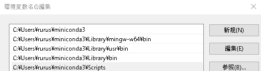
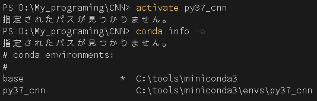

# Conda 環境の再構築

conda 環境が複数構築されていたので、整理をかねて一度全てアンインストールした。

その後、環境 Path を再設定し、`conda create` コマンドを使って環境を構築した。



この環境に、`activate` しようとしたが、できなかった。



この問題の解決方法がわからなかったので、調べてみた。

その際、以下のサイトを参考にした。

- [conda activate でエラーが出る話](https://qiita.com/8128/items/877caf785b20758ba7e0)

このサイトによると、

> PowerShell にこだわりがなければコマンドプロンプトを使う方法が一番堅実

よって、コマンドプロンプトを立ち上げ、`activate` を実行する。

```ComandPrompt
C:\Users\rurus>activate py37_cnn

(py37_cnn) C:\Users\rurus>
```

コマンドプロンプトから実行することで、仮想環境に入ることができた。

## VSCode のシェルを増やす

VSCode は既定のシェルを 1 つしか設定することができない。そこで、`Marketplace` から `Shell launcher` アドオンをインストールすることで、既定の `shell` を複数設定できるようにする。

その際、以下のサイトを参考にした。

- [vscode で複数のシェルを切り替えながら使う方法](https://qiita.com/FluffyHernia/items/d2f37a1e90df7b453637)

インストール後、`ファイル → ユーザ設定 → settings.json で編集`から `settings.json` ファイルを開いて以下を追加する。

```json
"shellLauncher.shells.windows": [
    {
      "shell": "C:\\Windows\\System32\\cmd.exe",
      "label": "cmd"
    },
    {
      "shell": "C:\\Windows\\System32\\WindowsPowerShell\\v1.0\\powershell.exe",
      "label": "PowerShell"
    },
    {
      "shell": "C:\\Program Files\\Git\\bin\\bash.exe",
      "label": "Git bash"
    },
    {
      "shell": "C:\\Windows\\System32\\bash.exe",
      "label": "WSL Bash"
    }
  ],
```

既定では、`Ctrl + Shift + p` で使用したいコマンドの欄から、`Shell Launcher: Launch` を選択し、さらに使用したい shell を選択する。

# 仮想環境構築後、パッケージをインストールする前に行うこと

## conda のアップデート

---

conda で仮想環境を構築した後、次のような警告が出ていた。

```python
==> WARNING: A newer version of conda exists. <==
  current version: 4.8.3
  latest version: 4.8.5
```

そこで、次のコマンドで `conda` 自体のアップデートを行う。

```python
(py37_cnn) D:\My_programing\CNN>conda update -n base -c defaults conda
Collecting package metadata (current_repodata.json): done
Solving environment: done

## Package Plan ##

  environment location: C:\tools\miniconda3

  added / updated specs:
    - conda


The following packages will be downloaded:

    package                    |            build
    ---------------------------|-----------------
    brotlipy-0.7.0             |py38he774522_1000         338 KB
    certifi-2020.6.20          |           py38_0         157 KB
    cffi-1.14.3                |   py38h7a1dbc1_0         223 KB
    conda-4.8.5                |           py38_0         2.9 MB
    cryptography-3.1.1         |   py38h7a1dbc1_0         528 KB
    idna-2.10                  |             py_0          50 KB
    pip-20.2.3                 |           py38_0         1.8 MB
    pyopenssl-19.1.0           |             py_1          48 KB
    requests-2.24.0            |             py_0          56 KB
    ruamel_yaml-0.15.87        |   py38he774522_1         264 KB
    setuptools-49.6.0          |           py38_1         758 KB
    tqdm-4.49.0                |             py_0          55 KB
    urllib3-1.25.10            |             py_0          98 KB
    yaml-0.2.5                 |       he774522_0          62 KB
    ------------------------------------------------------------
                                           Total:         7.2 MB

The following NEW packages will be INSTALLED:

  brotlipy           pkgs/main/win-64::brotlipy-0.7.0-py38he774522_1000

The following packages will be UPDATED:

  ca-certificates                                2020.1.1-0 --> 2020.7.22-0
  certifi                                 2020.4.5.1-py38_0 --> 2020.6.20-py38_0
  cffi                                1.14.0-py38h7a1dbc1_0 --> 1.14.3-py38h7a1dbc1_0
  conda                                        4.8.3-py38_0 --> 4.8.5-py38_0
  cryptography                         2.9.2-py38h7a1dbc1_0 --> 3.1.1-py38h7a1dbc1_0
  idna                                             2.9-py_1 --> 2.10-py_0
  openssl                                 1.1.1g-he774522_0 --> 1.1.1h-he774522_0
  pip                                         20.0.2-py38_3 --> 20.2.3-py38_0
  pycparser                                       2.20-py_0 --> 2.20-py_2
  pyopenssl          pkgs/main/win-64::pyopenssl-19.1.0-py~ --> pkgs/main/noarch::pyopenssl-19.1.0-py_1
  requests           pkgs/main/win-64::requests-2.23.0-py3~ --> pkgs/main/noarch::requests-2.24.0-py_0
  ruamel_yaml                        0.15.87-py38he774522_0 --> 0.15.87-py38he774522_1
  setuptools                                  46.4.0-py38_0 --> 49.6.0-py38_1
  six                   pkgs/main/win-64::six-1.14.0-py38_0 --> pkgs/main/noarch::six-1.15.0-py_0
  sqlite                                  3.31.1-h2a8f88b_1 --> 3.33.0-h2a8f88b_0
  tqdm                                          4.46.0-py_0 --> 4.49.0-py_0
  urllib3            pkgs/main/win-64::urllib3-1.25.8-py38~ --> pkgs/main/noarch::urllib3-1.25.10-py_0
  vs2015_runtime                     14.16.27012-hf0eaf9b_1 --> 14.16.27012-hf0eaf9b_3
  wheel               pkgs/main/win-64::wheel-0.34.2-py38_0 --> pkgs/main/noarch::wheel-0.35.1-py_0
  yaml                                     0.1.7-hc54c509_2 --> 0.2.5-he774522_0


Proceed ([y]/n)? y
```

## PowerShell から仮想環境にアクセスできるようにする。

---

仮想環境を `activate` する際、コマンドプロンプトを経由してアクセスしなければならなかったが、それではデバッグに不都合だったので、powershell からアクセスできるよう、セットアップする。

その際、次のサイトを参考にした。

- [PowerShell で Anaconda の仮想環境を activate する](https://qiita.com/nabehide/items/097553ccd51543ee31fb)

以下のコマンドを実行する。

```python
conda install -n root -c pscondaenvs pscondaenvs
```

このコマンドを実行することで、powershell から仮想環境にアクセスできるようになった。

```PowerSHell
PS D:\My_programing\CNN> activate py37_cnn
WARNING: You are using conda 4.8.5, which has built-in support for PowerShell.
WARNING: This script may stop working with conda versions newer than 4.6
WARNING: For more info on how to set up PowerShell for conda, run 'conda init --help'
WARNING: The conda.cli.activate module is deprecated and will be removed in a future release.
WARNING: The module conda.cli.activate is deprecated. It will be removed in a future feature release (i.e. minor version release).
WARNING: The conda.cli.activate module is deprecated and will be removed in a future release.
WARNING: The module conda.cli.activate is deprecated. It will be removed in a future feature release (i.e. minor version release).
(py37_cnn) PS D:\My_programing\CNN>
```

# 追加パッケージをインストールする

## pythorch

以下のコマンドで、python の version に合った pytorch を検索する。

```python
(py37_cnn) D:\My_programing\CNN>conda search pytorch
Loading channels: done
# Name                       Version           Build  Channel
pytorch                        1.0.1 cpu_py36h39a92a0_0  pkgs/main
pytorch                        1.0.1 cpu_py37h39a92a0_0  pkgs/main
pytorch                        1.3.1 cpu_py36h9f948e0_0  pkgs/main
pytorch                        1.3.1 cpu_py37h9f948e0_0  pkgs/main
pytorch                        1.4.0 cpu_py36ha775e86_0  pkgs/main
pytorch                        1.4.0 cpu_py37ha775e86_0  pkgs/main
pytorch                        1.4.0 cpu_py38ha775e86_0  pkgs/main
pytorch                        1.5.0 cpu_py37h9f948e0_0  pkgs/main
pytorch                        1.6.0 cpu_py37h538a6d7_0  pkgs/main
pytorch                        1.6.0 cpu_py38h538a6d7_0  pkgs/main
```

そして、該当したパッケージをインストールする。

```python
(py37_cnn) D:\My_programing\CNN>conda install pytorch=1.6.0=cpu_py37h538a6d7_0
Collecting package metadata (current_repodata.json): done
Solving environment: done

## Package Plan ##

  environment location: C:\tools\miniconda3\envs\py37_cnn

  added / updated specs:
    - pytorch==1.6.0=cpu_py37h538a6d7_0


The following packages will be downloaded:

    package                    |            build
    ---------------------------|-----------------
    _pytorch_select-0.1        |            cpu_0           4 KB
    blas-1.0                   |              mkl           6 KB
    cffi-1.14.3                |   py37h7a1dbc1_0         222 KB
    intel-openmp-2019.4        |              245         1.4 MB
    libmklml-2019.0.5          |                0        17.4 MB
    mkl-2019.4                 |              245        99.2 MB
    mkl-service-2.3.0          |   py37hb782905_0         210 KB
    mkl_fft-1.2.0              |   py37h45dec08_0         118 KB
    mkl_random-1.0.4           |   py37h343c172_0         287 KB
    ninja-1.10.1               |   py37h7ef1ec2_0         249 KB
    numpy-1.19.1               |   py37h5510c5b_0          22 KB
    numpy-base-1.19.1          |   py37ha3acd2a_0         3.8 MB
    pycparser-2.20             |             py_2          94 KB
    pytorch-1.6.0              |cpu_py37h538a6d7_0       101.1 MB
    six-1.15.0                 |             py_0          13 KB
    ------------------------------------------------------------
                                           Total:       224.1 MB

The following NEW packages will be INSTALLED:

  _pytorch_select    pkgs/main/win-64::_pytorch_select-0.1-cpu_0
  blas               pkgs/main/win-64::blas-1.0-mkl
  cffi               pkgs/main/win-64::cffi-1.14.3-py37h7a1dbc1_0
  intel-openmp       pkgs/main/win-64::intel-openmp-2019.4-245
  libmklml           pkgs/main/win-64::libmklml-2019.0.5-0
  mkl                pkgs/main/win-64::mkl-2019.4-245
  mkl-service        pkgs/main/win-64::mkl-service-2.3.0-py37hb782905_0
  mkl_fft            pkgs/main/win-64::mkl_fft-1.2.0-py37h45dec08_0
  mkl_random         pkgs/r/win-64::mkl_random-1.0.4-py37h343c172_0
  ninja              pkgs/main/win-64::ninja-1.10.1-py37h7ef1ec2_0
  numpy              pkgs/main/win-64::numpy-1.19.1-py37h5510c5b_0
  numpy-base         pkgs/main/win-64::numpy-base-1.19.1-py37ha3acd2a_0
  pycparser          pkgs/main/noarch::pycparser-2.20-py_2
  pytorch            pkgs/main/win-64::pytorch-1.6.0-cpu_py37h538a6d7_0
  six                pkgs/main/noarch::six-1.15.0-py_0


Proceed ([y]/n)? y
```

## anaconda-client

easydict など、既存の conda からはインストールできないパッケージをインストールするために、`anaconda-client` をインストールする。

以下のコマンドで、python の version に合った anaconda-client を検索する。

```python
(py37_cnn) D:\My_programing\CNN>conda search anaconda-client
Loading channels: done
# Name                       Version           Build  Channel
anaconda-client                1.6.5  py27h9642776_0  pkgs/main
anaconda-client                1.6.5  py35h18499f7_0  pkgs/main
anaconda-client                1.6.5  py36hd36550c_0  pkgs/main
anaconda-client                1.6.6  py27h68e804d_0  pkgs/main
anaconda-client                1.6.6  py35h690133a_0  pkgs/main
anaconda-client                1.6.6  py36ha174c20_0  pkgs/main
anaconda-client                1.6.7          py27_0  pkgs/main
anaconda-client                1.6.7          py35_0  pkgs/main
anaconda-client                1.6.7          py36_0  pkgs/main
anaconda-client                1.6.8          py27_0  pkgs/main
anaconda-client                1.6.8          py35_0  pkgs/main
anaconda-client                1.6.8          py36_0  pkgs/main
anaconda-client                1.6.9          py27_0  pkgs/main
anaconda-client                1.6.9          py35_0  pkgs/main
anaconda-client                1.6.9          py36_0  pkgs/main
anaconda-client               1.6.11          py27_0  pkgs/main
anaconda-client               1.6.11          py35_0  pkgs/main
anaconda-client               1.6.11          py36_0  pkgs/main
anaconda-client               1.6.12          py27_0  pkgs/main
anaconda-client               1.6.12          py35_0  pkgs/main
anaconda-client               1.6.12          py36_0  pkgs/main
anaconda-client               1.6.13          py27_0  pkgs/main
anaconda-client               1.6.13          py35_0  pkgs/main
anaconda-client               1.6.13          py36_0  pkgs/main
anaconda-client               1.6.14          py27_0  pkgs/main
anaconda-client               1.6.14          py35_0  pkgs/main
anaconda-client               1.6.14          py36_0  pkgs/main
anaconda-client               1.6.14          py37_0  pkgs/main
anaconda-client                1.7.1          py27_0  pkgs/main
anaconda-client                1.7.1          py35_0  pkgs/main
anaconda-client                1.7.1          py36_0  pkgs/main
anaconda-client                1.7.2          py27_0  pkgs/main
anaconda-client                1.7.2          py35_0  pkgs/main
anaconda-client                1.7.2          py36_0  pkgs/main
anaconda-client                1.7.2          py37_0  pkgs/main
anaconda-client                1.7.2          py38_0  pkgs/main
```

そして、該当したパッケージをインストールする。

```python
(py37_cnn) D:\My_programing\CNN>conda install anaconda-client=1.7.2=py37_0
Collecting package metadata (current_repodata.json): done
Solving environment: done

## Package Plan ##

  environment location: C:\tools\miniconda3\envs\py37_cnn

  added / updated specs:
    - anaconda-client==1.7.2=py37_0


The following packages will be downloaded:

    package                    |            build
    ---------------------------|-----------------
    anaconda-client-1.7.2      |           py37_0         199 KB
    attrs-20.2.0               |             py_0          42 KB
    brotlipy-0.7.0             |py37he774522_1000         336 KB
    chardet-3.0.4              |        py37_1003         193 KB
    clyent-1.2.2               |           py37_1          19 KB
    cryptography-3.1.1         |   py37h7a1dbc1_0         528 KB
    importlib-metadata-1.7.0   |           py37_0          52 KB
    importlib_metadata-1.7.0   |                0          11 KB
    ipython_genutils-0.2.0     |           py37_0          39 KB
    jsonschema-3.2.0           |           py37_1         107 KB
    jupyter_core-4.6.3         |           py37_0          85 KB
    nbformat-5.0.7             |             py_0          89 KB
    pyrsistent-0.17.3          |   py37he774522_0          91 KB
    pysocks-1.7.1              |           py37_1          28 KB
    python-dateutil-2.8.1      |             py_0         215 KB
    pytz-2020.1                |             py_0         184 KB
    pywin32-227                |   py37he774522_1         5.5 MB
    pyyaml-5.3.1               |   py37he774522_1         154 KB
    traitlets-5.0.4            |             py_0          82 KB
    win_inet_pton-1.1.0        |           py37_0           9 KB
    zipp-3.1.0                 |             py_0          13 KB
    ------------------------------------------------------------
                                           Total:         8.0 MB

The following NEW packages will be INSTALLED:

  anaconda-client    pkgs/main/win-64::anaconda-client-1.7.2-py37_0
  attrs              pkgs/main/noarch::attrs-20.2.0-py_0
  brotlipy           pkgs/main/win-64::brotlipy-0.7.0-py37he774522_1000
  chardet            pkgs/main/win-64::chardet-3.0.4-py37_1003
  clyent             pkgs/main/win-64::clyent-1.2.2-py37_1
  cryptography       pkgs/main/win-64::cryptography-3.1.1-py37h7a1dbc1_0
  idna               pkgs/main/noarch::idna-2.10-py_0
  importlib-metadata pkgs/main/win-64::importlib-metadata-1.7.0-py37_0
  importlib_metadata pkgs/main/noarch::importlib_metadata-1.7.0-0
  ipython_genutils   pkgs/main/win-64::ipython_genutils-0.2.0-py37_0
  jsonschema         pkgs/main/win-64::jsonschema-3.2.0-py37_1
  jupyter_core       pkgs/main/win-64::jupyter_core-4.6.3-py37_0
  nbformat           pkgs/main/noarch::nbformat-5.0.7-py_0
  pyopenssl          pkgs/main/noarch::pyopenssl-19.1.0-py_1
  pyrsistent         pkgs/main/win-64::pyrsistent-0.17.3-py37he774522_0
  pysocks            pkgs/main/win-64::pysocks-1.7.1-py37_1
  python-dateutil    pkgs/main/noarch::python-dateutil-2.8.1-py_0
  pytz               pkgs/main/noarch::pytz-2020.1-py_0
  pywin32            pkgs/main/win-64::pywin32-227-py37he774522_1
  pyyaml             pkgs/main/win-64::pyyaml-5.3.1-py37he774522_1
  requests           pkgs/main/noarch::requests-2.24.0-py_0
  traitlets          pkgs/main/noarch::traitlets-5.0.4-py_0
  urllib3            pkgs/main/noarch::urllib3-1.25.10-py_0
  win_inet_pton      pkgs/main/win-64::win_inet_pton-1.1.0-py37_0
  yaml               pkgs/main/win-64::yaml-0.2.5-he774522_0
  zipp               pkgs/main/noarch::zipp-3.1.0-py_0


Proceed ([y]/n)?
```

## easydict

easydict など、既存の conda からはインストールできないパッケージも、anaconda-client を使うことでインストールできる。

anaconda-client でのパッケージのインストールは以下のように行う。

### パッケージのサーチ

```python
(py37_cnn) D:\My_programing\CNN>anaconda search -t conda easydict
Using Anaconda API: https://api.anaconda.org
Packages:
     Name                      |  Version | Package Types   | Platforms       | Builds
     ------------------------- |   ------ | --------------- | --------------- | ----------
     auto/easydict             |      1.4 | conda           | linux-64, linux-32 | py27_0
                                          : https://github.com/makinacorpus/easydict
     conda-forge/easydict      |      1.9 | conda           | noarch          | py_0
                                          : Access dict values as attributes (works recursively).
     travis/easydict           |      1.4 | conda           | linux-64        | py27_0
                                          : https://github.com/makinacorpus/easydict
     tzl/easydict              |      1.7 | conda           | osx-64          | py36_0
                                          : Access dict values as attributes (works recursively).
     verydeep/easydict         |      1.6 | conda           | linux-64        | py27_0
                                          : Access dict values as attributes (works recursively).
     xxbandy123/easydict       |      1.7 | conda           | linux-64        | py27h320cd83_0
                                          : Access dict values as attributes (works recursively).
     zhaofeng-shu33/easydict   |      1.9 | conda           | win-64, noarch  | py_0, py36_0
                                          : Access dict values as attributes (works recursively).
Found 7 packages

Run 'anaconda show <USER/PACKAGE>' to get installation details
```

### インストールコマンドを検索

```python
(py37_cnn) D:\My_programing\CNN>anaconda show conda-forge/easydict
Using Anaconda API: https://api.anaconda.org
Name:    easydict
Summary: Access dict values as attributes (works recursively).
Access:  public
Package Types:  conda
Versions:
   + 1.9

To install this package with conda run:
     conda install --channel https://conda.anaconda.org/conda-forge easydict
```

### 検索したコマンドを使ってインストール

```python
(py37_cnn) D:\My_programing\CNN>conda install --channel https://conda.anaconda.org/conda-forge easydict
Collecting package metadata (current_repodata.json): done
Solving environment: done

## Package Plan ##

  environment location: C:\tools\miniconda3\envs\py37_cnn

  added / updated specs:
    - easydict


The following packages will be downloaded:

    package                    |            build
    ---------------------------|-----------------
    ca-certificates-2020.6.20  |       hecda079_0         184 KB  conda-forge
    certifi-2020.6.20          |   py37hc8dfbb8_0         151 KB  conda-forge
    easydict-1.9               |             py_0           9 KB  conda-forge
    openssl-1.1.1h             |       he774522_0         5.8 MB  conda-forge
    python_abi-3.7             |          1_cp37m           4 KB  conda-forge
    ------------------------------------------------------------
                                           Total:         6.1 MB

The following NEW packages will be INSTALLED:

  easydict           conda-forge/noarch::easydict-1.9-py_0
  python_abi         conda-forge/win-64::python_abi-3.7-1_cp37m

The following packages will be SUPERSEDED by a higher-priority channel:

  ca-certificates    pkgs/main::ca-certificates-2020.7.22-0 --> conda-forge::ca-certificates-2020.6.20-hecda079_0
  certifi               pkgs/main::certifi-2020.6.20-py37_0 --> conda-forge::certifi-2020.6.20-py37hc8dfbb8_0
  openssl                                         pkgs/main --> conda-forge


Proceed ([y]/n)?
```

# 仮想環境上の python ファイルをデバッグできない

conda を使用して仮想環境を構築したが、その内部に設置した python ファイルから numpy パッケージを import する際にエラーが発生した。

```python
serWarning: mkl-service package failed to import, therefore Intel(R) MKL initialization ensuring its correct out-of-the box operation under condition when Gnu OpenMP had already been loaded by Python process is not assured. Please install mkl-service package,
```

色々と検索してみたが、解決することができなかったので、環境を remove し再構築すると動作した。

原因はわからないが、エラーが発生した際の numpy パッケージは pytorch の動作に必要なパッケージとして自動的にインストールされたものだったので、このインストールに問題があったのではないかと考えている。

