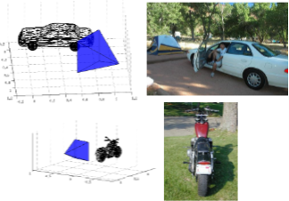
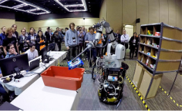
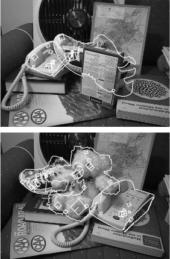

<!--
theme: default
size: 4:3
page_number: true
paginate: true
header: "2020年○月○日"
style: |

  section { font-size: 20px;}

  header {
    width: 100%;
    font-size: 20px;
    color: black;
    padding: 1px;
    top: 50px;
  }

  footer {
    width: 100%;
    font-size: 20px;
    color: black;
    text-align: right;
    padding: 15px;
  }

  h1 {
    font-size: 40;
    color: navy;
  }

  h2 {
    font-size: 35;
    color: navy;
  }

  h3 {
    font-size: 30;
    color: navy;
  }

  pre, code{
    font-size: 18px;
  }
-->

# PVNet 翻訳

---

# Beyond PASCAL：A Benchmark for 3D Object Detection in the Wild

多くのアプリケーションでは，境界ボックスやセグメンテーションだけではオブジェクトを表現するのに十分ではなく，オブジェクトの３次元的な表現をより豊かにすることが求められている．

そこで、本研究では新しいデータセット PASCAL3D+ を開発した.

データセットにおけるアノテーションの例.

---

# Analysis and Observations from the First Amazon Picking Challenge

## Amazon Picking Challenge(APC) の目的

第 1 回 Amazon Picking Challenge（APC）は、2015 年にワシントン州シアトルの IEEE International Conference onRobotics and Automation（ICRA）で 2 日間にわたって開催された。この大会の目的は、ウェアハウスオートメーションの長期的な目標[1], [2]である物体認識、動作計画、把持計画、タスク計画における最先端の技術の統合に関わる課題をロボット研究コミュニティに提供することであった。

倉庫の棚から取り出したオレオクッキーをトートに入れる RBO チームのロボット。
画像提供：RBO チーム

---

# Object Recognition from Local Scale-Invariant Features

SIFT（Scale Invariant Feature Transform: スケール不変特徴変換）と呼ばれる画像特徴量は、画像のスケーリング、並進、回転に不変であり、照明の変化やアフィン投影、三次元投影にも部分的に不変である。

SIFT の特徴は、霊長類の視覚の中では、インフェリア時間野(IT)皮質のニューロンの応答と共通する多くの特性を持っている。

図は、SIFT 特徴量を用いたオクルージョンのある 3 次元物体認識の例

---

# Monocular Model-Based 3D Tracking ofRigid Objects: A Survey
