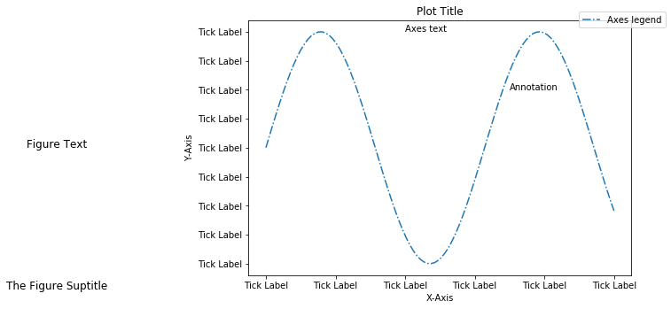

<!--
theme: default
size: 4:3
page_number: true
paginate: true
header: "2020年○月○日"
style: |

  section { font-size: 20px;}

  header {
    width: 100%;
    font-size: 20px;
    color: black;
    padding: 1px;
    top: 50px;
  }

  footer {
    width: 100%;
    font-size: 20px;
    color: black;
    text-align: right;
    padding: 15px;
  }

  h1 {
    font-size: 40;
    color: navy;
  }

  h2 {
    font-size: 35;
    color: navy;
  }

  h3 {
    font-size: 30;
    color: navy;
  }

  pre, code{
    font-size: 18px;
  }
-->

# 二変数関数のテイラー展開

二変数関数 $f(x, y)$ が $C^{(n+1)}$ 級なら、
$$
f(x+a, y+b) \simeq \sum_{t=0}^n \frac{1}{t!} \left( h\frac{\partial}{\partial x} + k\frac{\partial}{\partial y} \right)^t f(x, y)
$$

まとまっているが、少し分かりにくいので次のように展開する。

$$
f(x+a, y+b) = f(x, y) + 
$$

---

## やりたいこと

やりたいことは一変数関数の場合と同じ。**関数を多項式で近似したい、あわよくば無限攻の多項式(べき級数展開)で表現したい**という話。

その際、特定の点での関数情報（関数値、1階微分係数、2階微分係数、...）から近似多項式が求まる。

---

## 具体的な計算例

> 二変数関数 $f(x, y) = e^{(x+2y)}$ を $(x, y) = (0, 0)$ で二次までテイラー展開すると、
> $f(h, k) \simeq 1 + h + 2k + \frac{h^2}{2} + 2hk + 2k^2$

* 0次項
$f(0, 0) = 1$ すなわち 1

* 1次項
$f_x(x, y) = e^{x+2y} \rightarrow f_x(0, 0) = 1$
$f_y(x, y) = 2e^{x+2y} \rightarrow f_y(0, 0) = 2$
すなわち $\frac{1}{1!}(h+2k)=h+2k$

* 2次項
$f_{xx}(x, y)=e^{x+2y} \rightarrow f_{xx}(0, 0) = 1$
$f_{xy}(x, y)=2e^{x+2y} \rightarrow f_{xy}(0, 0)=2$
$f_{yy}(x, y)=4e^{x+2y} \rightarrow f_{yy}(0, 0)=4$
すなわち $\frac{1}{2!}\left( h^2 + 2 \cdot hk + 4 \cdot k^2 \right) = \frac{h^2}{2} + 2hk + 2k^2$

---

注：一変数関数 $e^X$ を $X = 0$ で二次まで展開すると $1 + X + \frac{x^2}{2}$ になる。これに $X = h+2k$ を代入しても上記の展開式が得られる。

$e^{(x+ 2y)}$ という複雑な関数が**二変数の二次関数** で近似できたのでうれしいというわけ。

注：「n次近似」というのは $h, k \rightarrow 0$ で誤差が $(\sqrt{h^2 + k^2})^n$ よりも素早く 0 に近づくという意味。

---

# Matplotlib

* matplotlib: データビジュアライゼーションパッケージ全体
* pyplot: matplotlibパッケージ内のモジュール。欲しいプロットを作るために暗黙的かつ自動的に図形や軸を作成するインタフェース。

# グラフの構成要素

