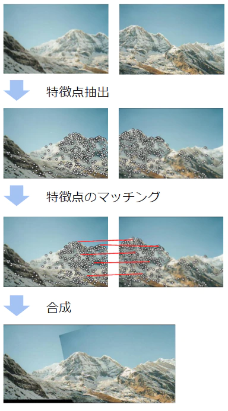

<!--
theme: default
size: 4:3
page_number: true
paginate: true
header: "2020年○月○日"
style: |

  section { font-size: 20px;}

  header {
    width: 100%;
    font-size: 20px;
    color: black;
    padding: 1px;
    top: 50px;
  }

  footer {
    width: 100%;
    font-size: 20px;
    color: black;
    text-align: right;
    padding: 15px;
  }

  h1 {
    font-size: 40;
    color: navy;
  }

  h2 {
    font-size: 35;
    color: navy;
  }

  h3 {
    font-size: 30;
    color: navy;
  }

  pre, code{
    font-size: 18px;
  }
-->

# 画像の特徴点とは

人間がジグソーパズルを組み立てられるのは、私たちが各ピースの特徴 (形状、描かれている模様など) を把握して、それと似た、連続する特徴を見つけ出してつなぎ合わせることができるから、といえる。

同様に、複数の写真をつなげてパノラマ写真にすることができるのは、写真間で共通する特徴を見つけ出してつなぎ合わせているから。

---

## 特徴点の種類

「特徴点」をシンプルに考えていくと、最終的に以下の3つに集約することができる。

ここで、
* **edge**: 差異が認識できる境界がある
* **corner**: edge が集中する点
* **flat**: edge でも corner でもない、特徴が何も認識できない点

---
## 特徴点を見つけるには

「特徴点」は、以下のルールに則って検出される。
* 再現性: ある特徴点は常に特徴点として認識される。
* 識別性: ある特徴点は、その他の特徴点と明確に異なると識別できる。

### 再現性

